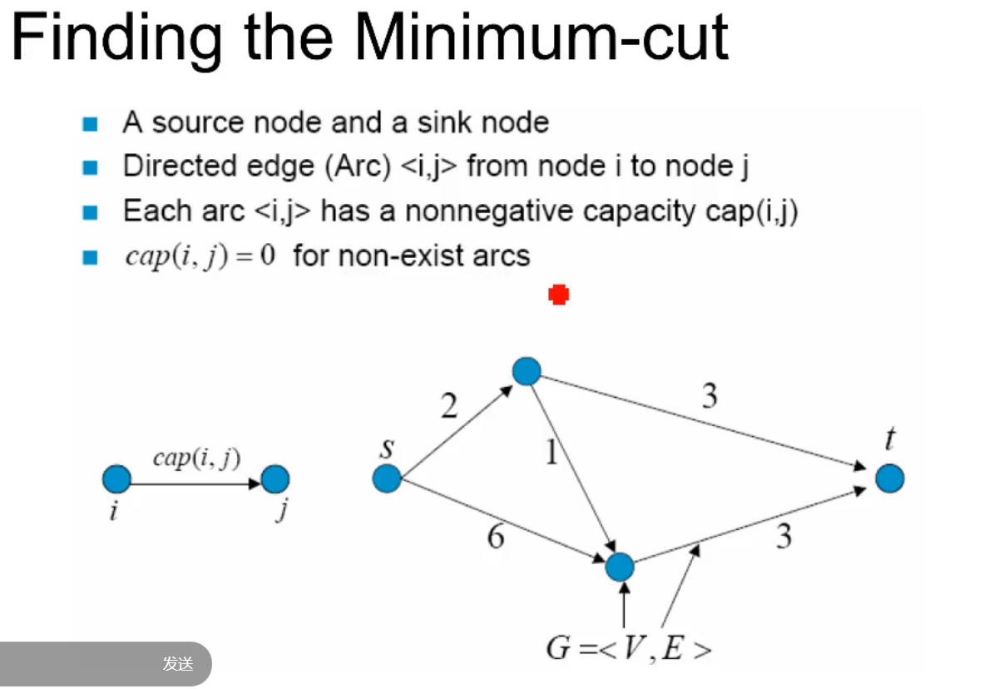

## Graph Cuts

$D_p(f_p)$ 数据项, 从端点到中间连线的 cost，被 label 成红色或者蓝色的 cost

$V_{p,q}$ 平滑相, 在这之间分割的 cost

#### 最大流 & 最小割

1.最大流不可能大于最小割，因为最大流所有的水流都一定经过最小割那些割边，流过的水流怎么可能比水管容量还大呢？

(最小割把 s 和 t 通道切断了，要从 s 走到 t 必定要走过最小割某一个通道)

2.最大流不可能小于最小割，如果小，那么说明水管容量没有物尽其用，可以继续加大水流。

由此可见，最大流和最小割的其实都是在求解同一个问题。

graph cut: 能够保留图像内部的信息，但在边界上可能不能很好地缝合

gradient domain: 边界缝合良好, 但是会把边界的 Error 传递到图像中心，导致图像被改变

User brush specific stroke as a label

用户的笔刷引导迭代过程

$\alpha \beta$ Swap