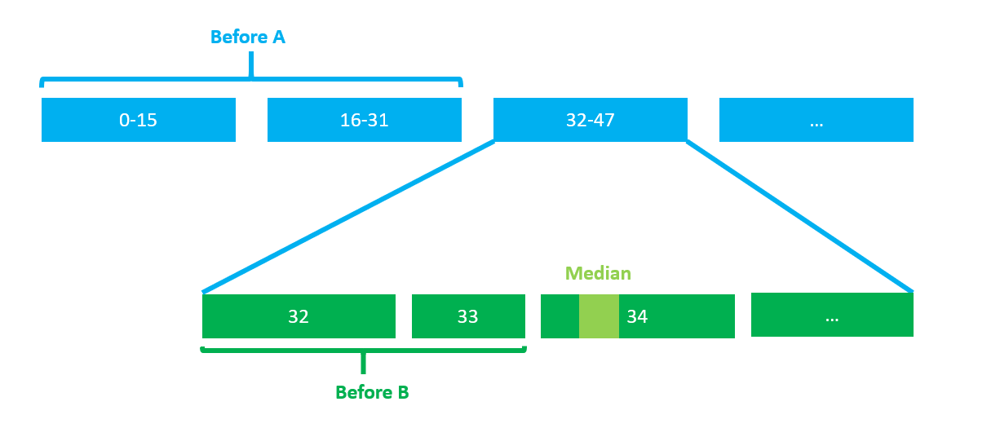
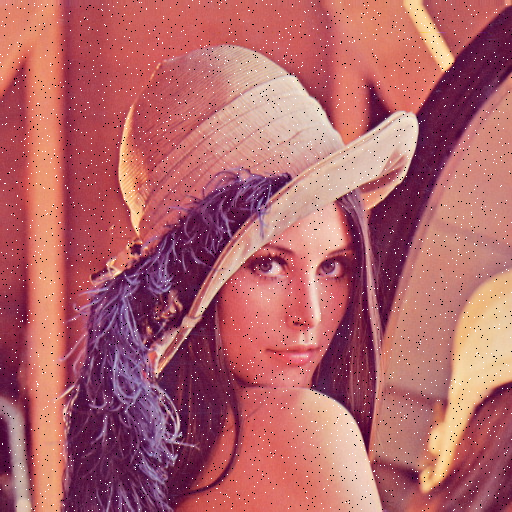
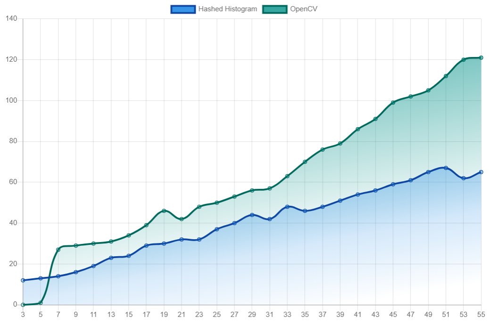
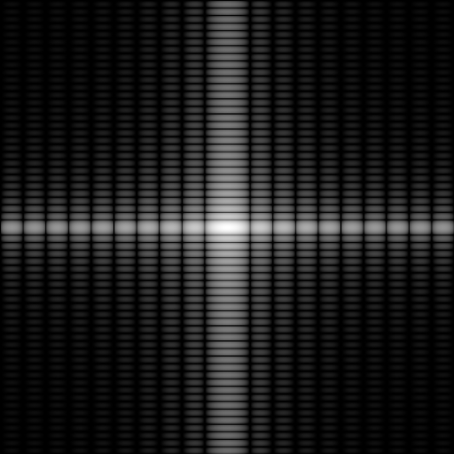
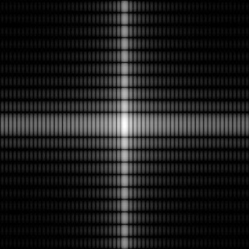
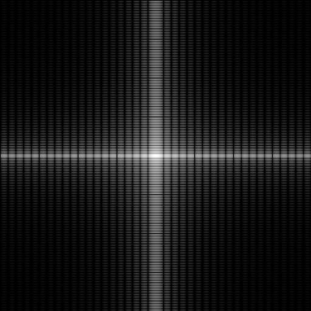

# Lab 2  图像的数字化、颜色空间、滤波与频域变换

林昭炜  3170105728

数媒1701


## 1. 实验内容

本次实验分为如下任务和我完成的情况简介

#### 实现盒状均值滤波

在实验中我提供了计算盒状滤波的卷积核算法，利用 `filter2D` 进行卷积


#### 实现高斯滤波

在实验中我提供了计算高斯核的算法，利用 `filter2D` 进行卷积


#### 中值滤波

在实验中我设计并优化了中值滤波算法，在中值滤波模板大小较大的时候，利用多线程优势实现比 OpenCV 快的代码。

除此之外我还提供了 Python 脚本给 Lena 撒椒盐。


#### 简单的双边滤波

在实验中我实现了简单的双边滤波。


#### 傅里叶变换完成图像的频域变换

利用 OpenCV 的傅里叶变换实现图像的频域变换


## 2. 实现环境

**编译环境:**  Visual Studio 2019, C++ latest

**运行环境**: Windows 10,16GB RAM, i7 7700HQ

**OpenCV**: OpenCV 4.11


## 3. 理论基础

#### 均值滤波

均值滤波是用像素邻域的平均值代替原有的像素
$$
I'(x, y) = \frac{1}{|N|}\sum_{(u,v)\in N}I(x+u, y+v).
$$
我们可以利用空域的卷积来实现对滤波:
$$
K(u,v)=\begin{cases}
\frac1{|N|} & (u,v)\in N, \\
0 & otherwise.
\end{cases}
$$
所以均值滤波可以写成:
$$
I'(x,y) = \sum_{(u,v)\in N}K(u,v)I(x+u,y+v).
$$


#### 高斯滤波

高斯滤波是一种线性平滑滤波，适用于消除高斯噪声。高滤波的卷积核的特点是其权重随着距离递减。高斯滤波的公式如下:
$$
I'(x,y) = \sum_{(u,v)\in N}K(u,v)I(x+u,y+v),\\
G(u,v) = \frac{1}{2\pi\sigma^2}exp(-\frac{u^2+v^2}{2\sigma^2}).
$$
其中我们的卷积核大小是 $(2*\lfloor\sigma\rfloor+1)\times(2*\lfloor\sigma\rfloor+1)$.


#### 中值滤波

在有些噪音比如椒盐噪音 (Salt & Pepper), 高斯滤波无法得到良好的滤波效果。中值滤波是一种序统计滤波器（Order-Statistic Filter），与均值滤波不同，中值滤波器用邻域内像素亮度的中值来取代原本的像素值，
$$
I(x,y)=\text{Median}\{I(x+u,y+v)|(u,v)\in N\}.
$$
中值滤波对于椒盐噪声有比较好的抑制效果.


#### 双边滤波

双边滤波解决了问题，它可以保持边缘的同时进行降噪和平滑，其不仅仅像高斯滤波那样考虑了像素之间的空间距离，还考虑了像素亮度差异，将其通过高斯分布函数之后作为系数乘进去，这样做的好处是让相似的像素权重更高，起到保边的作用，缺点是每一个像素要重新计算卷积核，时间远远高于高斯滤波。

双边滤波的公式如下：
$$
P'(x_p,y_p)=\frac1{W_{pq}}\sum_{q \in S}G_{\sigma_s}(||p-q||)G_{\sigma_r}(|I_p-I_q|)P(x_q,y_q)I,\\
W_{pq} = \sum_{q \in S}G_{\sigma_s}(||p-q||)G_{\sigma_r}(|I_p-I_q|).
$$
这样子滤波器能同时对空间域(Spatial Domain, $\sigma_s$) 和像素的亮度(Range Domain, $\sigma_r$) 做出响应。


## 4. 实验细节

#### 均值滤波

均值滤波只要计算出一个均值滤波核即可，C++ 代码如下:

```c++
Mat kernel(Size{ w, h }, CV_32F);
kernel = 1.0f / w / h; // normalize
```

然后利用 OpenCV 现有的卷积函数:

```c++
filter2D(src, src, -1, kernel);
```


#### 高斯滤波

计算高斯核每一个元素的值算法如下：

```pseudocode
h, w = kernel.height / 2, kernel.width / 2
a = 1/(2*pi*sigma2)
b = 1 / sigma2
for i, j in range(kernel.height, kernel.width):
	dh = i - h
	dw = j - w
	nominator = dw * dw + dh * dh
	g = a * exp(-nominator * b)
	kernel[i][j] = g
```

同样的利用 `Filter2D` 来进行卷积


#### 中值算法

中值算法最简单的版本是通过排序获取中值:

```c++
vector arr = all_pixel_in_window();
sort(arr);
median = arr[arr.size()/2]
```

优点是 STL 实现了快排，速度很快，但是缺点是对于$N\times M$ 的中值窗口，每个像素需要 $O(MNlog(MN))$ 的时间。

我思考并且查找了一些资料，想到了以下几种优化 (不妨设 $N > M$, 以便之后的分析)

- 对排序算法的优化，快排通常需要对pivot两边分别递归排序，对于寻找中值来说只要一边即可，但这样做没有在数量级上优化
- 利用堆的办法，分别维护一个 max heap 和一个 min heap, 两个堆大小相等。每次移动中值的统计窗口的时候删除旧的元素和添加新的元素，最后维持两个堆的平衡。最坏的情况是一个堆一直被删除，另一个一直被添加，这样子我们还要操作 $4*N$ 下. 理论上删除和增加快的堆如斐波那契堆、二项堆都需要 $O(logMN)$ 时间完成，意味着时间复杂度是 $O(NlogMN)$, 但实际上这可能比排序还慢: 首先复杂度的常数非常大，在以前的ADS 实验中发现这个常数大到无法忽略，其次堆不断移动指针等对 CPU Cache 非常不友好。
- 维护一个完全平衡的树。这个算法实现难度过大，我没有纳入考虑。

最终我决定使用哈希直方图的办法。我维护两个数组，数组 A 大小是 16 个，数组 B 大小是 256， 对于每个窗口内的像素值 `I` 做如下运算:

```c++
A[I / 16]++;
B[I]++;
```

接着我们要计算中值的时候只要现在数组 A 里搜索大致范围，然后在数组 B 里精确定位。这样子时间复杂度是 $O(MN+32)=O(MN)$


但是还可以进一步优化，每一次我们移动窗口的时候，只有一部分数据发生了改变，我们不需要更新所有数据，所以我们需要额外维护两个变量，如下图所示:



变量 Before A 记录中位数所在的 A 数组位置之前的和。Before 记录了中位数在 A 数组对应的 16 个 B 数组元素中，在它之前的元素和。

这样子我们只要检查被替换掉的元素，对应更新 Before A 和 Before B 的大小，然后我们从 (Before A + Before B) 开始找起来，重新定位中位数。

实际上这样还是比 OpenCV 慢很多，大约是 3 倍的差距。所以我想到了利用多线程的技术，每条线程分别对图片的一部分进行计算，从而实现在窗口较大的情况下 (>=7) 比 OpenCV 更快的算法 (详见实验结果)。不过 OpenCV 在窗口只有 3 或者 5 的情况下快得不可思议，通常 1ms 不用就好了。


#### 双边滤波

双边滤波的速度非常慢，我也没有头绪从何优化，所以我用的还是比较简单的版本。

首先是要预先计算出距离的高斯函数值 `dists`，这样就不需要再循环中反复计算了。

其次对于每个像素我们可以用以下伪代码计算:

```c++
for p in the window
	int delta_I = *p - center;
	double tmp = 100 * dists[n++] * gauss_r.calc(delta_I);
	sum += tmp * *p;
	norm += tmp;
return sum / norm;
```


#### 傅里叶变换

这里调用 OpenCV 自带的 `dft` 大大地简化了工作量，因此伪代码如下:

```pseudocode
function GetDFTImg(im):
	res = dft(im)
	center_0_frequency(res)
	magnitude = res.channel(0).^2 + res.channel(1).^2
	log(magnitude + 1)
	normalize(magnitude, max=1, min=0)
```

其中 `center_0_frequency` 是最复杂的，但是再实验指导书中已经给出源码了其大致吧左上角的零频率移动了中心。


## 5. 结果展示与分析

| Lena                                          | 均值滤波 19x19                                |
| --------------------------------------------- | --------------------------------------------- |
|                          |                |
| **均值滤波 4x4**                              | **均值滤波 15x4**                             |
|  |  |

一个长宽不一致的均值滤波给人以摄像机手抖的感觉


| Lena                                                    | Gauss 滤波 $\sigma=10$ 窗长 101                         |
| ------------------------------------------------------- | ------------------------------------------------------- |
|                      |                |
| **Gauss 滤波 $\sigma=5$ 窗长 51**                       | **Gauss 滤波 $\sigma=15$ 窗长 151**                     |
|  |  |


| 椒盐Lena                                                     | **Median 9x9**                                               |
| ------------------------------------------------------------ | ------------------------------------------------------------ |
|                                   |  |
| **Median 29x29**                                             | **Median 59x59**                                             |
|  |  |

我的算法与 OpenCV 算法速度对比，纵轴单位 ms, 横轴单位是 窗口的大小:



> 这里不用偶数窗口是因为 OpenCV 不支持


| Lena                                                      | 双边滤波 $\sigma_s=4, \sigma_r=10$                        |
| --------------------------------------------------------- | --------------------------------------------------------- |
|                        |                |
| **双边滤波** $\sigma_s=9, \sigma_r=9$                     | **双边滤波** $\sigma_s=9, \sigma_r=19$                    |
|  |  |
| **双边滤波** $\sigma_s=19, \sigma_r=9$                    | **双边滤波** $\sigma_s=31, \sigma_r=41$                   |
|  |  |


| FFT                                     | FFT 旋转 90度                                               |
| --------------------------------------- | ----------------------------------------------------------- |
|                      |  |
| **FFT 平移**                            | **FFT 放大**                                                |
|  |                        |

如果把图片旋转之后做 FFT 会导致 FFT 图像不同方向的粗细情况发生变化。因为一个更大的白块会是 FFT 的信号频率变小，结果是 FFT 图像亮的区域向中心集中，所以这个原理对 FFT 放大也有效。因为对振幅进行了归一化，所以很难看出对频率强度的影响。

除此之外平移对 FFT 强度信号没有影响。这只改变了相位。


## 6. 编译运行

#### 编译说明

由于要支持 Lambda 捕获 Structured  Deconstruction, 需要 C++20 支持，所以要开启 C++/latest 编译选项和 Visual Studio 2019.

编译不同的程序需要在 `config.h` 中开启不同的编译选项:

| 宏                   | 说明                                              |
| -------------------- | ------------------------------------------------- |
| `HW_5_1`             | 编译 Box Filter                                   |
| `HW_5_2`             | 编译 Gaussian Filter                              |
| `HW_5_3_NAVIVE`      | 编译使用 `std::sort` 获取 median 的 Median Filter |
| `HW_5_3`             | 编译使用 Bin 算法获得的 Median Filter             |
| `HW_5_3_THREAD_POOL` | 编译使用多线程优化的 Bin 算法的 Median Filter     |
| `HW_5_4`             | 编译 Bilateral Filter                             |
| `HW_5_5`             | 编译傅里叶变换                                    |


#### 运行说明

已经将所有的程序放在 bin 下面，所有程序都支持实验指导书要求的参数格式，除了双边滤波添加了可选参数指定窗口大小。


脚本 "tst.bat"  可以一键运行所有的 7 个程序。输出结果一律写到 `results/` 下，请务必建好文件夹。

| 程序                    | 参数格式                                                     | 说明                                            |
| ----------------------- | ------------------------------------------------------------ | ----------------------------------------------- |
| BoxFilter               | `<input-image> <output-image> <w> <h>`                       |                                                 |
| GaussianFilter          | `<input-image> <output-image> <sigma>`                       |                                                 |
| MedianFilterNaive       | `<input-image> <output-image> <w> <h>`                       | 利用 sort 实现的 median                         |
| MedianFilter            | 同上                                                         | 利用哈希直方图的实现                            |
| MedianFilterMultiThread | 同上                                                         | 利用多线程强化的哈希直方图，比 OpenCV 快        |
| BilateralFilter         | `<input-image> <output-image> <sigma-s> <sigma-r> -w <width> -h <height>` | `-w`, `-h` 是可选参数，但是必须放到必要参数后面 |
| DFT                     |                                                              | 这个程序自产自销小方块                          |


`sp.py` 提供了给图像撒椒盐的功能。需要安装 `opencv-python` 和 `numpy` 。

