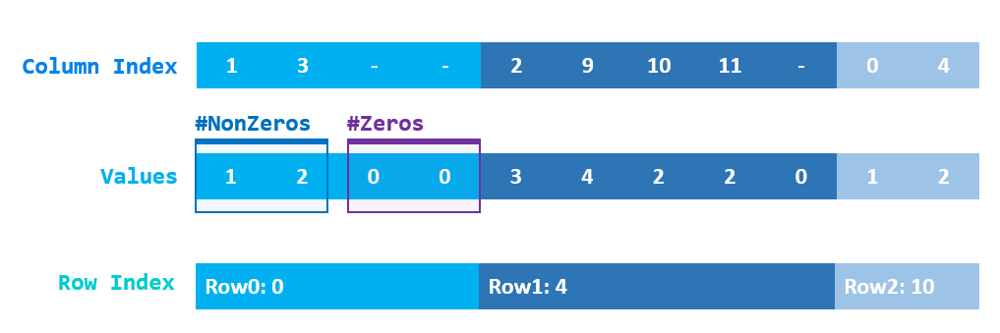

# Lab3. 稀疏矩阵与迭代求解线性方程

林昭炜  3170105728  数媒1701


## 1. 试验内容

本次实验分为如下任务和我完成的情况简介

#### 稀疏矩阵的实现

我用 C++ 实现了一个稀疏矩阵类。 和 Eigen 相比在增加了 25%-50% 左右的空间开销，比 Eigen 快的访问速度、比 Eigen 快很多的插入速度 (大约500x)。同时也支持了实验指导要求的初始化函数。

除此之外我为了验证我的代码的正确性，写了一些测试函数和辅助函数。

为了对比和 Eigen 的速度，我写了 Python 脚本负责 Benchmark 代码。


#### Gauss-Seidel 迭代

实现了 Gauss-Seidel 迭代，并且针对了稀疏矩阵进行了优化。


#### 共轭梯度法

实现了共轭梯度法，并且针对了稀疏矩阵进行了优化。


## 2. 实现环境

**编译环境**: Visual Studio 2019, C++ lates

**运行环境**: Windows 10,16GB RAM, i7 7700HQ

**Eigen**: v3.3.3 Nuget包管理安装


## 3. 理论基础

#### 稀疏矩阵

稀疏矩阵的基本思路是只存储数据非0的元素，然后通过额外的索引帮助确定元素所在的行、列的位置，老师主要指出了两种存储方式:

1. Compressed Row Storage
2. Compressed Sparse Column

在实验中，我选择了比较直观的 Compressed Row Storage (CRS)。


#### Gauss 迭代法 & Jacobi 迭代法

Gauss 迭代法和 Jacobi 迭代法很像。两个迭代法的思路都是从一个随意指定的值开始，将猜测的值反复代入线性方程组去逼近最终结果。[^gauss_jacob]

Jacobi 迭代法的想法是把猜测的向量值，把一个分量设为未知，代入对应的线性方程中，从而更新那个位置的分类，更加形式化的表述如下:
$$
对于方程组
\begin{cases}
a_{11}x_1+a_{12}x_2+...+a_{1n}x_n =b_1 \\
a_{21}x_1+a_{22}x_2+...+a_{2n}x_n =b_2 \\
a_{n1}x_1 + a_{n2}x_2 + ...+a_{nn}x_n=b_n
\end{cases},\\
迭代公式为: 
\begin{cases}
x^{(0)}=(x_1^{(0)},x_2^{(0)},...,x_n^{(0)})^T,\\
x_i{(k+1)} = \frac1{a_{ij}}(b_i-\sum_{j=1,j\ne i}^na_{ij}x_j^{(k)}).
\end{cases}
$$
其中 $x^{(k)}$ 是第 $k$ 次迭代向量。

为了更加方便表述，我们可以把矩阵记为 $Ax=b$, 那么我们可以法 $A$ 分裂为 $A = D+L+U$, 其中:
$$
D=
\left[\begin{matrix}
a_{11} & & & \\
&a_{22}&\\
&&...\\
&&&a_{nn}
\end{matrix}\right],\ \ 
L=
\left[\begin{matrix}
0\\
a_{21}&0\\
...& ...& ...\\
a_{n1} & a_{n2} & ... & 0
\end{matrix}\right],\ \ 
D=
\left[\begin{matrix}
0 & a_{12} & ... & a_{1n}\\
& 0 & ...& a_{2n}\\
& & ... & ...\\
&&& 0
\end{matrix}\right].
$$
那么矩阵的可以变形为 $Dx = -(L+U)x+b$, 那么 $x=-D^{-1}(L+U)+D^{-1}b$, 我们可以记为:
$x = Bx+d$, 那么我们的迭代公式就变成了:
$$
\begin{cases}
x^{(0)}=(x_1^{(0)},x_2^{(0)},...,x_n^{(0)})^T,\\
x^{(k+1)=Bx^{(k)}+d}.
\end{cases}
$$
Gauss 迭代法最重要的区别在于其认为最新计算出来的分量要比旧的分量要好，所以同样的我们用以上的矩阵的方法来表述我们的迭代: [^gauss]
$$
Dx = -(L+U)x+b,\\
Dx^{(k+1)}=-Lx^{(k+1)}-Ux^{k}+b,\\
x^{(k+1)} = -(D+L)^{-1}Ux^{(k)}+(D+L)^{-1}b,\\
\begin{cases}
x^{(0)}=(x_1^{(0)},x_2^{(0)},...,x_n^{(0)})^T,\\
x^{(k+1)} = -(D+L)^{-1}Ux^{(k)}+(D+L)^{-1}b.
\end{cases}
$$
关于收敛的问题，一种办法是看矩阵的谱半径。

首先矩阵的范数可以用向量诱导，即 $||A||=\max\{||Ax||/||x||\}$,  [^mat_norm]

然后我们来看谱半径的定义，如果 $\lambda_i$ 是矩阵的特征值，$\rho(A)=\max\limits_{i\le i\le n}\{|\lambda_i|\}$, 由矩阵范数的定义我们有:
$$
|\lambda_i|\cdot||\bold u_i|| = ||\lambda_i\bold u_i|| = ||A\bold u_i||\le||A||\cdot||\bold u_i||,
$$
其中 $\bold u_i$ 是特征向量。从而我们能证明  $\rho(A)\le ||A||$。

然后是这样一个定理: 迭代格式如 $x^{(k+1)}=Hx^{(k)}+g$, 其收敛的充要条件是 $\rho(H)\lt 1$, 我们恒容易有推论: $||H||\lt 1$ 时也是收敛的。

除此之外可以通过矩阵是不是对称正定，或者对角占优的判断是否是收敛。

[^mat_norm]: https://baike.baidu.com/item/矩阵范数/5296169?fr=aladdin

[^gauss_jacob]: https://blog.csdn.net/Reborn_Lee/article/details/80951058

[^gauss]: https://blog.csdn.net/weixin_40679412/article/details/80283690


#### 共轭梯度法

求解 $Ax=b$ 的时候，我们可以转化为对二次型 $f(x)=\frac12x^TAx-b^Tx+c$ 导数为0的求解。

即我们有:
$$
\frac{df(x)}{dx} = Ax-b.
$$
这里只要暴力把矩阵和向量展开相乘即可证明，不在此赘述。

二次型也影响了这个方法的局限性: 下图依次时二次型在正定、负定、半正定和不定的情况:


> https://www.jianshu.com/p/3ca4971a1a19

可以发现当矩阵不定的时候有鞍点，无法通过导数为0求极值。


然后共轭梯度法的关键在于希望每一次迭代每个方向都走到了极致, 也即是说寻找极值的过程中绝不走曾经走过的方向。 [^cg] 基于这个想法，我们在每一次前进的时候和前进后误差正交，这就意味着我们有一个方向不需要再走了。把下一步方向记作 $r_t$, 目标为 $x^*$, 那么误差时 $e_t=x^*-x_t$, 那么我们误差与上一步方向正交意味着 $r_{t-1}^Te_t=0$, 但是我们不知道方向，所以我们用共轭正交代替 $r_{t-1}^TAe_t=0$. 

首先我们确定步长:
$$
e_t=x^*-x_t \implies e_{t+1}=x^*-x_{t+1}=e_t+x_t-x_{t+1},\\
r_{t}^TAe_{t+1} = r_{t}^TA[e_t+x_t-x_{t+1}]=r_{t}^TA[e_t-\alpha_tr_t]=0,\\
\implies \alpha_t = \frac{r_t^TAe_t}{r_t^TAr_t}, 而 \nabla f(x)=Ax-b,\\
\implies \alpha_t = \frac{r_t^TA(x^*-x_t)}{r_t^TAr_t} = \frac{r_t^T(b-Ax_t)}{r_t^TAr_t} = -\frac{r_t^T\nabla f(x_t)}{r_t^TAr_t}.
$$
而方向的确定希望每次都是共轭正交，我们可以通过 $-\nabla f(x_t)$ 确定我们的梯度方向，我们可以很方便的用施密特正交化把之前走过的方向消除从而达到与之前正交：
$$
r_t=-\nabla f(x_t) + \sum_{i<t}\frac{r_i^TA\nabla f(x_t)}{r_t^TAr_t}r_i.
$$
所以我们更新向量就是: $x_{t+1} = x_{t}+\alpha_t r_t$.

[^cg]: https://zhuanlan.zhihu.com/p/64227658


## 4. 实验细节

### 稀疏矩阵



首先我用 `Values` 保存了所有的数据，同样的一个数组`Column Index`与之对应保存了对应的 Column 信息。

之所以使用 Structure of Arrays 是因为很多操作只在 `Column Index` 里面搜索Column, 而如果使用 Array of Structures 会使得 Cache 很大一部分浪费再保存无用的 Values上，大大牺牲了 Cache 的命中率。

接下来我需要把 `Value` 数组划分成一个个小的数组，着通过了额外的两个数组 `#NonZeros` 和 `#Zeros` 来统计小数组内非零元素和空闲空间的数量。之所以这样是因为如果把行中某一个元素置零会非常快，只需要移动一小步数据即可，同样的，当插入元素的时候，如果已经有些剩余空间，那么我们也只需要搬动少量的元素即可。这对插入速度远超过 Eigen 起到了重要的作用，但是着也不可避免地带来额外的内存开销。

最后 `Row Index` 保存着当前行第一个元素在 Values 里偏移。

实际上以上的代码模拟了 `srd::vector<std::vector<T>>` 的效果，之所以不直接用是如下原因：

- 大量的 `std::vector<T>` 造成内存碎片化
- 内存不连续，访问效率低下，连续内存使得 Cache 访问友好，编译器也能更好优化代码
- `std::vector` 一般有 `begin`, `end`, `end_of_storage`, `allocator` 这4个指针，64 bit 系统上大约是 32bytes, 而我的实现只占用 12 bytes (3个int)。

代码中 `row_num_nze_` 代表 Number of Non Zero Elements, 对应图中 `#NonZeros`, `row_space_left_` 对应图中的 `#Zeros`.


#### 访问

我们需要考虑如下几种情况

```c++
T at(Index row, Index col) const {
    // 1. 如果这一行没有 Non Zero Elements, 那么一定是 0
    if (!row_num_nze_[row])
        return T(0);
	//   查找最接近 (row, col) 的位置
    Index idx = getNearestIndex(row, col);
	
    // 2. 如果找到对应的，那么我们返回这个值
    if (col_offset_[idx] == col) {
        return values_[idx];
    }
	
    // 3. 我们没有找到，返回 0
    return T(0);
}
```

在很多行全 0 的情况下随机查找能很快。


#### 插入

insert 非常复杂，这里要需要考虑 6 种情况

1. insert 元素是 0
   1. 被 insert 的元素本身是 0   **(1)**
   2. 被 insert 的元素非 0         **(2)**
2. insert 元素非 0
   1. 这个元素本来就非 0  **(3)**
   2. 这个元素本来是 0
      1. 在这个 row 里还有剩余空间  **(4)**
      2. 这个 row 已经没有剩余空了 **(5)**

所以对应的代码如下:

```c++
void insert(T&& val, Index row, Index col) {
    return val == T(0) ?
        // 分别处理插入 0 or 1 的情况
        insertZero(row, col) :
    	insertNoneZero(std::forward<T>(val), row, col);
}
```

```c++
void insertZero(Index row, Index col) {
		// 情况1.1: 这一行全是 0 元素，那我们什么都不用做
		if (row_num_nze_[row] == 0) {
			return;
		}

		Index idx = getNearestIndex(row, col);

		// 情况2 : 这里原来是个非0元素，那么
		if (col_offset_[idx] == col) {
            // 更新统计信息
			--row_num_nze_[row];
			++row_space_left_[row];
            // 我们要从小数组里删除这个元素 (把后面元素往前移)
			auto cnt = idx - row_begin_[row];
			auto all = row_num_nze_[row] - cnt;
			memmove(values_.data() + idx, values_.data() + idx+1, all * sizeof(T));
			memmove(col_offset_.data() + idx, col_offset_.data() + idx+1, all * sizeof(T));
		}
		// 情况1.2: 插入的元素是 0 元素，啥都不用干
	}
```

```c++
void insertNoneZero(T&& val, Index row, Index col) {
		Index idx = row_begin_[row];

		if (row_num_nze_[row]) {
			idx = getNearestIndex(row, col);
			// 情况3: 这个元素本来就是非0, 那么我们直接更新就好了
			if (col_offset_[idx] == col) {
				values_[idx] = std::forward<T>(val);
				return;
			}
		}

		// 情况4: 我们还有剩余空间
		if (row_space_left_[row]) {
            // 声明这个空间被用了
			--row_space_left_[row];
            // 把元素后移腾出空间
			Index beg = idx;
			Index cnt = row_begin_[row] + row_num_nze_[row] - idx - 1;
			memmove(values_.data() + beg + 1, values_.data() + beg, cnt * sizeof(T));
			memmove(col_offset_.data() + beg + 1, col_offset_.data() + beg, cnt * sizeof(Index));
            // 写入数据
			values_[idx] = std::forward<T>(val);
			col_offset_[idx] = col;
		}
		// 情况5: 我们没用空间了
		else {
            // 用 std::vector 的 API 直接往对应位置插入即可
			values_.insert(values_.begin() + idx, val);
			col_offset_.insert(col_offset_.begin() + idx, col);
			auto sz = static_cast<Index>(row_begin_.size());
            // 更新 Row Index 偏移
			for (Index i = row + 1; i < sz; ++i) {
				++row_begin_[i];
			}
		}

		++row_num_nze_[row];
	}
```


#### 初始化

初始化基本上是拷贝和移动了一下原始的数据，所以非常快：

```c++
void initializeFromVector(const IndexVector& rows, IndexVector&& cols, Vector&& vals) {
    // 把 value & column index 直接移动进来即可		
    values_ = std::forward<Vector>(vals);
    col_offset_ = std::forward<IndexVector>(cols);
	
    // 计算一下 rows & cols
    n_rows_ = rows.back() + 1;
    n_cols_ = 0;
    for (auto x : col_offset_) {
        n_cols_ = std::max(n_cols_, x);
    }
    n_cols_++;
	
    // 准备初始化空间
    row_begin_.clear();
    row_begin_.resize(n_rows_, 0);
    row_space_left_.clear();
    row_space_left_.resize(n_rows_, 0);
	
    // 我们在这里遍历 row 从而统计每个 row Non Zero 的个数, 注意两点
    // 1. 数组必须是先按照 row 再按照 col 排序
    // 2. 这里允许数组中出现 0 元素, 所以会修正 value & column index
    Index idx = 0;
    Index ridx = 0;
    Index last_row = -1;
    for (auto& r : rows) {
        if (r != last_row) {
            last_row = r;
            ridx = idx;
        }
        if (values_[idx] == 0) {
            ++row_space_left_[r];
        }
        else {
            ++row_begin_[r];
            values_[ridx] = values_[idx];
            col_offset_[ridx] = col_offset_[idx];
            ++ridx;
        }
        ++idx;
    }

    row_num_nze_ = row_begin_;
	
    // 更新我们的 Row Index
    Index sum = 0;
    Index num = 0;
    for (auto& r : row_begin_) {
        Index last_sum = sum;
        sum += r + row_space_left_[num];
        r = last_sum;
        ++num;
    }
}
```


#### 查找最近的元素

算法里经常出现 `getNearestIndex`, 这负责在一个 column 里搜索最接近的 (row, col) 的位置。一开始我使用的顺序遍历查找，当然非零元素占所有元素在 5% 以内的时候没什么区别，但是当超过  10% 之后速度会显著比 Eigen 慢。我看了一下 Eigen 源码，发现其思路和我差不多，它也有个查找最近的元素算法: `searchLowerIndex`, 而它用的是二分查找, 所以我也用二分查找改进代码.

在引入二分查找之前, 1000x1000大小的矩阵在非零元素占比 80% 的时候，遍历所有元素速度是 300-400ms 左右, 而 Eigen 一般 80-100ms，而加入以后只需要 40ms 即可。

注意这里比较的是直接通过索引访问元素的速度，如果遍历的话 Eigen 提供了 Iterator, 理论上访问更快。但这里更加倾向于比较随机访问的速度。


#### 对向量线性变换

矩阵的基本操作之一是乘以向量，实现对向量的线性变换，这里因为在之后的代码里没什么特殊的要求，只实现了左乘的算法:

```c++
void applyToVector(std::vector<double>& in, std::vector<double>& out) {
    for (Index i = 0; i < n_rows_; ++i) {
        Index idx = row_begin_[i];
        double sum = 0;
        for (Index j = 0; j < row_num_nze_[i]; ++j) {
            auto col = col_offset_[idx];
            sum += values_[idx] * in[col];
            ++idx;
        }
        out[i] = sum;
    }
}
```

在代码里我不直接用 `at(row, col)` 函数，因为这样的效率太低了，我们知道每一行的所有的非0元素以及所在的列，我们只需要计算非零元素和向量对应元素的乘积和即可。


### Gauss-Seidel 迭代法

Gauss 迭代法的伪代码如下;

```pseudocode
while not converge:
	last_guess = guess
	for i=1:n
		sigma = 0
		for j=1:n
			if j != i: sigma += a[i][j]*guess[j]
		guess[i] = (b[i] - sigma) / a[i][i]
	converge = dist(last_guess, guess) < epsilon
```

这里在实际实现的时候要考虑两个问题, 一个是`a[i][i]` 可能是 0, 另一个是我们可以针对稀疏矩阵做优化，即只遍历非 0 元素。

在计算距离`dist()`的时候，用的是类似曼哈顿距离算法，并且我们可以用 C++ 的 `std::transform_reduce` 并行化计算, 不过首先我们需要声明一个计算 $|a-b|$ 的 `functor`:

```c++
template <>
struct abs_diff<void> {
	using is_transparent = int;

	template <class _Ty1, class _Ty2>
	constexpr auto operator()(_Ty1&& _Left, _Ty2&& _Right) const
		noexcept(noexcept(static_cast<_Ty1&&>(_Left) + static_cast<_Ty2&&>(_Right))) // strengthened
		-> decltype(static_cast<_Ty1&&>(_Left) + static_cast<_Ty2&&>(_Right)) {
		return std::abs(static_cast<_Ty1&&>(_Left) - static_cast<_Ty2&&>(_Right));
	}
};
```

在这之后我们可以把 `functor` 实例传入函数，让 C++ 标准库帮我们计算:

```c++
inline double manhattonDist(const std::vector<double>& a, const std::vector<double>& b) {
	M_ASSERT(a.size() == b.size(), "dims of 2 vecs mismatch");
	return std::transform_reduce(std::execution::par,  /* 并行化 */
		a.begin(), a.end(),  /* 左值 */
         b.begin(),  /* 右值 */
         0.0,  /* reduce 的初始值 */
         std::plus<>(),  /* reduce 操作 */
          abs_diff<>()  /* transform 操作 */
          );
}
```

所以最终的 Gauss Seidel 算法如下:

```c++

std::vector<double> gaussSeidel(std::vector<double> b, double epsilon = 1e-6, int max_iteration = 1000) {
    M_ASSERT(b.size() == n_cols_, "len(b) must match matrix's column");
    std::vector<double> x(b.size(), 1.0f);
    std::vector<double> prev(b.size(), 1.0f);
    double eps = 10;
    int cnt = 0;
    while (eps > epsilon && cnt < max_iteration)
    {
        prev = x;
        for (Index i = 0; i < n_rows_; ++i) {
            auto a_ii = at(i, i);
            if (a_ii == 0) {
                continue;
            }
            double sigma = 0;
            Index idx = row_begin_[i];
            for (Index j = 0; j < row_num_nze_[i]; ++j) {
                auto col = col_offset_[idx];
                if (col != i) {
                    sigma += values_[idx] * x[col];
                }
                ++idx;
            }
            x[i] = (b[i] - sigma) / a_ii;
        }

        eps = manhattonDist(x, prev);
        ++cnt;
    }
    return x;
}
```


### Conjugate Gradient

共轭梯度的伪代码如下：

```pseudocode
r = b - A * x
p = r
k = 0
while true:
	alpha = dot(r, r) / dot(p, A * p)
	x = x + alpha * p
	r1 = r - alpha * A * p
	if len(r1) < epsilon: break
	beta = dot(r1, r1) / dot(r, r)
	p = r1 + beta * p
	r = r1
end while
```

这里常用的对向量的操作是线性和:  $\bold{r} = \bold a + k\bold b$, 我们可以把它抽象成函数:

```c++
template<typename T>
inline void vecadd(const std::vector<T>& a, const std::vector<T>& b, T scale_b, std::vector<T>& out) {
	std::transform(std::execution::par,
		a.begin(), a.end(), b.begin(), out.begin(), 
         [scale_b](auto a, auto b) { return a + scale_b * b; });
}
```

还有一个就是两个向量的点积: $\bold r= \bold a^T\bold b$, 同样的抽象成函数:

```c++
template<typename T>
inline double dotProd(const std::vector<T>& a, const std::vector<T>& b) {
	return std::transform_reduce(std::execution::par,
		a.begin(), a.end(), b.begin(), 0.0, std::plus<>(), std::multiplies<>());
}
```

所以最终的共轭梯度迭代法的代码如下:

```c++
std::vector<double> conjugateGradient(const std::vector<double>& b, double epsilon = 1e-6, int max_iteration = 1000) {
    std::vector<double> x(b.size(), 0);
    std::vector<double> r(b.size());
    std::vector<double> r1(b.size());
    applyToVector(x, r);
    vecsub(b, r, r);
    std::vector<double> p = r;
    int k = 0;

    std::vector<double> Ap(b.size());
    int cnt = 0;
    while (cnt < max_iteration)
    {
        applyToVector(p, Ap);
        double alpha = veclen2(r) / dotProd(p, Ap);
        vecadd(x, p, alpha, x);
        vecadd(r, Ap, -alpha, r1);
        auto r1len = veclen2(r1);
        if (r1len < epsilon) break;
        double beta = r1len / veclen2(r);
        vecadd(r1, p, beta, p);
        using std::swap;
        swap(r1, r);
        ++cnt;
    }

    return x;
}
```


### 测试

#### 校验矩阵的维护

在测试中我通常会维护一个 `std::vector<std::vector<int>>` 的二维非压缩数组，我对任何 Sparse Matrix 的更改都要反应到这个非压缩的里，所以我用 C++ lambda 把对 Sparse Matrix 的操作和非压缩数组绑定:

```c++
SparseMatrix<int> spi;
std::vector<std::vector<int>> mat;
auto modify = [&](int x, int row, int col, std::string label) {
    spi.insert(x, row, col);
    mat[row][col] = x;
    prt(label);
    if (!CheckEqual(spi, mat)) {	
        throw;
    }
};
```


#### 正确性测试

正确性测试很简单，我们只要把Sparse Matrix 每个元素拿出来和校验矩阵对比即可:

```c++
template<typename T>
bool CheckEqual(SparseMatrix<T> mat, std::vector<std::vector<T>> v) {
	for (int i = 0; i < mat.rows(); ++i)
		for (int j = 0; j < mat.cols(); ++j)
			if (mat.at(i, j) != v[i][j]) 
				return false;
	return true;
}
```


#### 手工数据测试

首先我的算法必须通过手工数据测试，这里把之前所有的 5 个情况，即 5 个执行路径进行了测试:

```c++
modify(0, 1, 0, "Test1 - make zero val 0");
modify(0, 0, 0, "Test2 - make non zero val 0");
modify(1, 2, 2, "Test3 - the matrix is not modified");
modify(8, 0, 0, "Test4 - make non zero val on row with extra space left");
modify(9, 1, 1, "Test5 - make non zero val on row with NO extra space left");
```

除此之外还需要对 老师给出的测试矩阵进行测试:

```c++
SparseMatrix<int> sp2;
sp2.initialize(4, 4, {
    10, -1,  2,  0,
    -1, 11, -1,  3,
    2, -1, 10, -1,
    0,  3, -1,  8
});
auto vec = sp2.gaussSeidel(b); print("By gauss seidel", vec);
vec = sp2.conjugateGradient(b); print("By CG", vec);
```


#### 大批量数据测试与 Benchmark

最后一步是对其性能的测试，并且进一步验证正确性, 

首先测试的是初始化, 实验指导书规定的初始化格式和 Eigen 不一样，所以建立两份一样的初始数据，我的初始化很快是因为默认参数是先行后列 sorted 并且没有重复元素，Eigen 可能没有这个限制，所以这个速度比较没有意义。在这里只是对大规模数据初始化的正确性验证。初始化的参数分为两个:

| 参数          | 解释                                                |
| ------------- | --------------------------------------------------- |
| `size`        | 矩阵的大小是 `size * size`                          |
| `density`     | 随机初始化的时候 density% 的元素会初始化为非 0 元素 |
| `modify_rate` | 在修改元素的时候 modify_rate% 的元素会被修改        |


接下来测试的是对矩阵元素访问的速度， Eigen 使用的是 `coeff` 函数, 为了防止编译器优化掉我们的代码, 我遍历所有元素的时候把得到的值和 `volatile` 参数异或了一下:

```c++
volatile int c = 0;
timer.Start();
for (int i = 0; i < size; ++i)
    for (int j = 0; j < size; ++j)
        c ^= esp.coeff(i, j);
timer.End().Print("[Access all elements] Eigen");

timer.Start();
for (int i = 0; i < size; ++i)
    for (int j = 0; j < size; ++j)
        c ^= sp.at(i, j);
timer.End().Print("[Access all elements] Mine");
```


最后测试的是修改元素的测试，为了能同步随机修改两个矩阵，我首先预存了要修改的数据:

```c++
std::vector<Eigen::Triplet<int>> mods;
int modify_rate = 20;
for (int i = 0; i < size; ++i)
    for (int j = 0; j < size; ++j)
        if (rand() % 100 < modify_rate) {
            auto val = rand() % 10000;
            mods.push_back({ i, j, 0 });
            mat[i][j] = 0; // 同步到校验矩阵上以便之后的校验
        }
```

然后利用已有的校验数据对矩阵进行修改并检查:

```c++
timer.Start();
for (auto& m : mods)
    esp.coeffRef(m.row(), m.col()) = m.value();
timer.End().Print("[Modify elements] Eigen");

timer.Start();
for (auto& m : mods)
    sp.insert(m.value(), m.row(), m.col());
timer.End().Print("[Modify elements] Mine");

if (!CheckEqual(sp, mat)) {
    std::cout << "[!!Error] My implementation is wrong" << std::endl;
}
```


## 5. 结果展示与分析

#### 结果展示

在测试中程序可以一路运行到底，说明中间没有 throw, 如果检错代码发现错误会直接 `throw`, 程序会猝死。

在 Benchmark 中也没有任何错误，否则会打印 `[!!Error]...`


而迭代计算矩阵也是正确的:


#### 性能分析

首先比较矩阵的稀疏程度和插入、修改的速度比较，数据量是 1000x1000, 纵轴是时间 (ms)


Eigen 修改数据极其缓慢，添加了修改数据之后的表格:


然后是性能和矩阵大小的关系: 在访问方面，我比 Eigen 快那么一点点的原因是 Eigen需要处理 row major 和 column major 的情况，但是我固定的 row major。


同样的 Eigen 修改元素的速度非常慢，增长趋势基本上是 $O(N^2)$。


## 6. 编译运行

#### 编译说明

本次实验需要用到 C++17 的特性，但是 Eigen 使用 C++ 中 Deprecated 的特性，所以必须要加上 `_SILENCE_CXX17_NEGATORS_DEPRECATION_WARNING`.

本次实验的 Eigen 库是用 Nuget 一键安装的，VS 应该能自动下载所需的依赖

同时本次实验依赖库 `cxxopts` [^cxx] , 用来解析命令参数的。


#### 运行说明

运行 `./lab3 -s <size> -d <density> -m <modify>`.

 所有参数都是可选的，都会有默认参数。

`./lab3 -h` 查看帮助。


#### 脚本说明

脚本 `benchmark.py` 负责生成上面测试的数据，它会调用 `-b ` 选项抑制无用的输出（但是还是会输出错误信息），然后通过正则匹配查找时间数据并且写入json。

需要安装 `pip install progressbar2`.

[^cxx]: https://github.com/jarro2783/cxxopts

