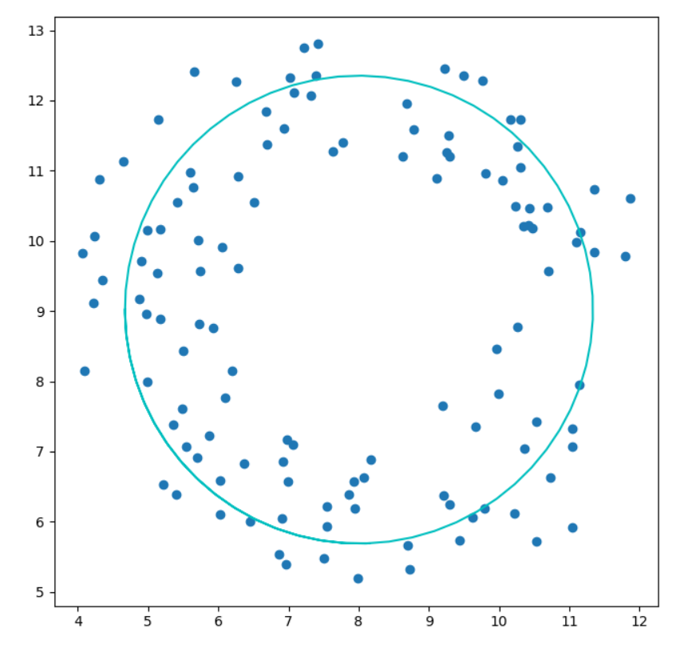
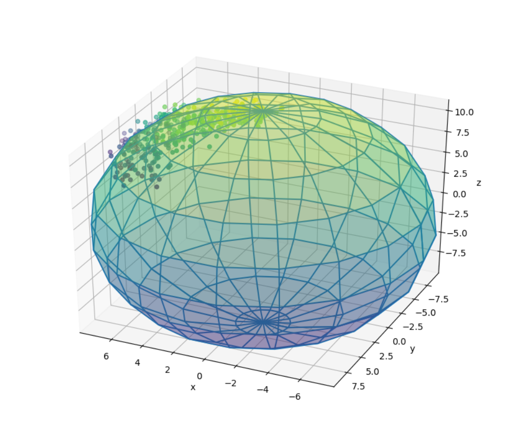

# Lab4. 非线性最小二乘

林昭炜  3170105728  数媒1701


## 1. 试验内容

本次实验分为如下任务和我完成的情况简介

#### 实现 Gauss-Newton 迭代优化

在实验中我严格按照输入格式实现了我的 Gauss-Newton 迭代优化器 `class Solver5728`.


#### 实现 Backtracking & Exact Line Search

实现了最简单的 Exact Line Search, 并且略做优化, 实现了 Backtracking Line Search.


#### 实现 3 个 Residual Functions

三个 Functions 包括了:

- 线性函数的Residual Function

```c++
LineResidual(double k, double b, int num_dots, 
             bool perturb_x = false, bool perturb_y = false)
```

- 圆方程的 Residual Function

```c++
CircleResidual(double A, double B, double R)
```

- 椭圆方程的 Residual Function, 支持从文件里读入, 从而可以读入老师的测试样例

```c++
EclipseResidual(double A, double B, double C);
EclipseResidual(std::string filename)
```


#### 实现对实验结果可视化分析的 Python 脚本

很多时候我们很难判断输出结果正确与否，或者结果拟合的情况，所以我写了一个 Python 脚本从 C++ 输出的文件 (包含坐标和方程参数), 可视化结果，方便判断与分析。


## 2. 实现环境

**编译环境**: Visual Studio 2019, C++ latest

**运行环境**: Windows 10,16GB RAM, i7 7700HQ

**OpenCV**: 4.1.1

**Python**: 3.7 (matplotlib, numpy)


## 3. 理论基础

#### Gauss-Newton 迭代优化

高斯牛顿迭代法源于牛顿法，最速梯度下降发使用的是梯度作为每次迭代方向，而牛顿法考虑到了二阶导数的信息。但是在利用二阶信息的时候我们需要计算 Hessian 矩阵，而这个矩阵的计算消耗量比较大，空间也需要特别大，因此提出了专门针对最小二乘的 GN 算法。


首先我们知道最小二乘的公式如下: $F(\bold x) = || R(\bold x) ||^2_2$, 其中 $R(\bold x)$ 是残差函数，我们对 $R(\bold x)$ 进行泰勒展开代入原方程。首先我们计算一下:
$$
\begin{equation}
J_F = \frac{\partial F}{\partial R}\cdot\frac{\partial R}{\partial x} = \frac{\partial (||R||^2_2)}{\partial R}\cdot J_R = 2R^TJ_R
\end{equation}
$$

$$
\begin{align*}
F(x+\Delta x) &= ||R(x+\Delta x)||^2_2 \approx ||R(x) + J_R\Delta x||^2_2 \\
&=||R(x)||^2_2 + 2R^TJ_R\Delta x + \Delta x^TJ^T_RJ_R\Delta x \\
& \text{By (1) we have:}\\
& =F(x) + J_F\Delta x + \Delta x^TJ^T_RJ_R\Delta x
\end{align*}
$$

我们想要最快到达目的，则意味着:
$$
\begin{align*}
\frac{\partial F}{\partial\Delta x} 
& = \frac{\partial(F(x) + J_F\Delta x + \Delta x^TJ^T_RJ_R\Delta x)}{\partial\Delta x} \\
&=J_R^TJ_R\Delta x +J_R^TR
= 0
\end{align*}
$$
所以我们迭代的方向就是:
$$
\Delta x = (J_R^TJ_R)^{-1}J_R^TR
$$


#### Backtracking Line Search

Exact Line Search 通过每一步迭代是匀速的，每隔一个间隔采样是否到达了目标。

Backtracking 方法更加聪明，对于 $F(x+\alpha\Delta x)$ 来说, 我们确定了 $x, \Delta x$, 而 $\alpha$ 是变量，我们不妨设为 $\phi(\alpha)$, 那么我们希望能满足如下不等式:
$$
\phi(\alpha)\le\phi(0)+\gamma\phi'(\alpha)\alpha.
$$
其中我们需要求出 $\phi'(0)$:
$$
\begin{align*}
\phi'(0)=\frac{dF(x+\alpha\Delta x)}{d\alpha}
&= \frac{dF(x+\alpha \Delta x)}{d(x+\alpha\Delta x)}\Delta x\\ 
&= \Delta F^T(x) \Delta x\\
&\approx ||\Delta x||^2
\end{align*}
$$

#### Residual Functions

这里我们考察三种 Residual Functions。

对于直线我们有:
$$
\begin{equation*}
f(x) = kx+b\\
J_f[i] = [\frac{\partial f}{\partial k}, \frac{\partial f}{\partial b}] = [x_i, 1].
\end{equation*}
$$
其中 $J_f[i]$ 是第 $i$ 行 Jacobi 矩阵。


对于圆来说，我们使用参数方程生成:
$$
\begin{equation*}
f(\theta) = \left[
\begin{matrix}
a + r*cos(\theta)\\
b + r * sin(\theta)
\end{matrix}
\right] +
\left[
\begin{matrix}
\epsilon_1\\
\epsilon_2
\end{matrix}
\right]
\end{equation*}
$$
其中 $\epsilon_1, \epsilon_1$ 是随机的误差。

对应的求导有:
$$
\begin{equation*}
\nabla f(a, b, r) =\left[\begin{matrix}
- 2 * (x-a)\\
- 2 * (y - b)\\
-2 * r
\end{matrix}
\right]
\end{equation*}
$$


对于椭球方程我们有生成的参数方程:
$$
\begin{equation*}
f(\theta, \varphi) = \left[
\begin{matrix}
Asin(\theta)cos(\varphi)\\
Bsin(\theta)sin(\varphi)\\
C cos(\theta)
\end{matrix}
\right] +
\left[
\begin{matrix}
\epsilon_1\\
\epsilon_2\\
\epsilon_3
\end{matrix}
\right]
\end{equation*}
$$
同样的我们有对应的梯度:
$$
\begin{equation*}
\nabla f(A, B,C) =\left[
\begin{matrix}
-2 x^2/A^3\\
-2 y^2/B^3\\
-2 z^2/C^3\\
\end{matrix}
\right]
\end{equation*}
$$
残差则是:
$$
\begin{equation*}
R(x, y, z, A, B, C) = \frac{x^2}{A^2}+\frac{y^2}{B^2}+\frac{z^2}{C^2}-1
\end{equation*}
$$


## 4. 实验细节

### Gauss-Newton 迭代优化

Gauss-Newton 的核心算法如下, 只要按照公式给出的写，用 OpenCV 的矩阵操作即可。

```c++
double solve(
		ResidualFunction* pf, 
		double* pX,           
		GaussNewtonParams param = GaussNewtonParams(), 
		GaussNewtonReport* report = nullptr
	) override
	{
		auto& f = *pf;
		int n = 0;

		int nX = f.nX();
		int nR = f.nR();

		cv::Mat1d R(nR, 1); // Residual
		cv::Mat1d J(nR, nX); // Jacobi
		cv::Mat1d JT(nX, nR); // transpose of Jacobi
		cv::Mat1d JT_J(nX, nX); // JT * J
		cv::Mat1d Dx(nX, 1); // \Delta x, direction of descent
		cv::Mat1d X(nX, 1, pX); // paramters to be optimized
		cv::Mat1d b(nX, 1); // bias

		while (n < param.max_iter)
		{
			f.eval(data(R), data(J), data(X));
			cv::transpose(J, JT);
			JT_J = JT * J;
			b = -JT * R;
			if (!cv::solve(JT_J, b, Dx))
				error("Numerical Failure, cannot solve linear system\n");
			
			auto max_res = maxabs(R);
			auto max_grad = maxabs(Dx);

			if (max_res < param.residual_tolerance ||
				max_grad < param.gradient_tolerance )
				break;
			if (n == param.max_iter)
				error("Failed to converge\n");

			// damped newton parameter
			double alpha = param.exact_line_search ?
				linear_search_algo(f, R, J, X, Dx, max_res) 
				: backtracking_algo(f, R, J, JT, X, Dx);
			X += alpha * Dx;

			if (alpha == 0)
                error("Search stopped at local minimum\n")

			++n;
		}

		memcpy(pX, X.data, nX * sizeof(double));
		return sum(R)[0];
	}
```


在 Verbose Mode 下面我们模仿了 Google Ceres 库的输出:

```c++
printf("iter\tcost\t\tcost_change\tgradient\tstep\titer_time\ttotal_time\n");
//...
FPrints(max_res, last_res == inf? 0.0 : max_res - last_res, max_grad, alpha, 
					total_time - last_time, total_time);
```


### Line Search

#### Exact Line Search

大致思路是循环十次，每次如果残差下降的话我们就知道我们可以继续扩大我们的 Step, 但是如果 残差没有下降，我们需要减小 Step, 因此我们后退回原来的位置，把步长的变化率缩减为原来的十分之一。

设置了最大的迭代次数是 1000次，防止无限循环。

```c++
static double linear_search_algo(ResidualFunction& f, cv::Mat1d& R, cv::Mat1d& J, const cv::Mat1d& X, const cv::Mat& Dx, double min)
	{
		cv::Mat1d mX = X.clone();
		double min_alpha = 0;
		int i = 1; // step
		double denominator = 1; // step size
		double alpha = 0; // result
		int n = 0; // iteration counter
		bool reached = false; // if reach a place smaller than original

		// If we completed 10 iterations, and at least one iteration
		// found a suitable step size alpha
		// Otherwise we will keep iterate for 1000 times waiting for the 
		// step that can minimize Residual
		while (n < 10 || (!reached && n < 1000))
		{
			// step forward, compute new residual
			alpha += i / denominator;
			mX = X + alpha * Dx;
			f.eval(data(R), data(J), data(mX));

			// if the next step makes residual lesser , that is good
			// we record the alpha(step size) as min_alpha
			if (double eps = maxabs(R); eps < min)
			{
				min = eps;
				min_alpha = alpha;
				reached = true;
			}
			// The reisudal is larger than min, that means
			// we may overstepped, therefore we withdraw the
			// step, shrink our step size by factor of 10
			else
			{
				alpha -= i / denominator;
				denominator *= 10;
				i = 0;
			}
			++n;
			++i;
		}
		return min_alpha;
	}
```


#### Backtracking Line Search

根据公式我们的伪代码如下:

```c++
double gamma, beta, alpha; // parameters
double phi = dot(dx, dx)
while F(x+alpha*dx) < F(x) + alpha * phi * gamma
    alpha *= beta
```

然后我们检查小于的时候使用如下函数:

```c++
// check all elements in R is larger or equal to L
auto one_greater = [](const double* L, const double* R, int count)
{
    for (int i = 0; i < count; ++i, ++L, ++R)
        if (*L > *R)
            return true;
    return false;
};
```


### Residual Functions

Residual Functions 我们可以根据在前一章提到的公式来写，类和构造函数的签名如下:

```c++
class LineResidual : public ResidualFunction{
    // ...
	LineResidual(double k, double b, int num_dots, 
                 bool perturb_x = false, bool perturb_y = false); // will we add noise
    // ...
}

class CircleResidual : public ResidualFunction
{
    // ...
    // (x-A)^2+(y-B)^2=R^2
    CircleResidual(double A, double B, double R);
    // ...
}

class EclipseResidual : public ResidualFunction
{
    // ...
    EclipseResidual(double A, double B, double C);
    EclipseResidual(std::string filename);
}
```


而噪音的生成如下:

```c++
double noise(scale){
    return (rand() % 256 - 256)/512.0) * scale;
}
```


### Python Plotting

最后是 Python 绘制, 它从文件里读入两类数据: 优化后的参数和数据点，然后用参数绘制拟合后的函数图像，用数据点绘制散点图。


## 5. 结果展示与分析

#### 结果展示

在程序里依次测试了直线、圆形和椭球的拟合，其中椭球是从文件中读入，实验指导书给的测试样例:

首先是使用 Backtracking:


然后是使用 Exact Line Search:


可以发现 Exact Line Search 每次迭代速度比较慢，但需要迭代的次数比较小，相反，Backtracking 每次迭代非常快，但是需要更多次迭代，除此之外 Backtracking 在 拟合 Circle 上更加接近 Truth。


Python 可视化如下:

| 圆                                                           | 椭球                                                         |
| ------------------------------------------------------------ | ------------------------------------------------------------ |
|  |  |
| **圆** 高噪声                                                | **椭球** 局部数据点                                          |
|  |  |

在局部数据点的情况下，如果初值给得太大，回导致优化时收敛到一个非常大的参数上。


## 6. 编译运行

#### 编译说明

本次实验需要支持 C++17 的编译器。

需要用到 OpenCV. 请把 `bin/OpenCV411.dll` 拷贝到 `src/OpenCVHW1/` 目录下 

对于 Python 来说, 需要`matplotlib` 和 `numpy` 这两个包。


#### 运行说明

提供了测试时编译的好的 Release 文件，在命令行内可以运行。

Python 文件也可以直接运行。