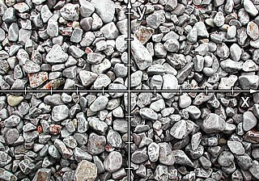

# Lab7. 增强现实

林昭炜 3170105728  数媒1701


## 1. 实验内容

本次实验分为如下任务和我完成的情况简介

- 使用了 Vuforia SDK, 在 Unity 上进行实验

- 实现了 Image Target 的导入和显示模型
- 实现了简单的交互，包括了单击、长按、旋转等。
- 实现了Virtual Button
- 实现了一个简单的玩具小车应用，可以切换小车，让小车蓄能之后移动。


## 2. 实现环境

**编译环境:** Visual Studio 2019， Unity 2019.3.3f1

**运行环境**: Windows 10,16GB RAM, i7 7700HQ

**Vuforia**: 8.5.9

**Unity 资源**: Project Car - Raider, Low Poly Soldiers Demo


## 3. 理论基础

以下理论是从 Vuforia 官网 [^a]学习的，所以使用的图片都是从 Vuforia 官网获取的。

### Image Target

Vuforia 很重要的一部分是 Image Target, 它主要依赖的是对图像的特征提取，

| 原图                                                   | 提取的特征                                            |
| ------------------------------------------------------ | ----------------------------------------------------- |
|  |  |

而要能提取良好的特征需要图片满足如下特性:

- 丰富的细节
- 很好的对比度
- 没有重复的纹理


Vuforia 提取特征的时候依赖的是图像比较尖锐的区域，通常来说:

| 图像                                                         | 解释                                 |
| ------------------------------------------------------------ | ------------------------------------ |
| ![img](data:image/png;base64,iVBORw0KGgoAAAANSUhEUgAAAGwAAABoCAYAAAAU9xXbAAAOH0lEQVR4nO2dW2xdVXqA/305PsdOIAlMScREMSGEXkbTvlRt1ZH6XlVVH6s+VOrLCI3UdIDQFiYMDDNcWxighUyhaNRpFam0qkTbaVUuSQgk4NiO49hOSHy/JsHxJb6cfc7ea6/19WGtfXwcoFI1GXn2eG/pE+Fc7fXt/1//WsvSL6DQaQIaSBMws2CmMcvDoBchiUFpAJZrK6RATccoFCkKg31u017mC2hcGtBcX17EoIlqMSo1GCCJDaRAqkHNQ30UagPANOjIvdW4r9EonSBpmpLUY/tk7TrVa72M9L/FwOl/I1kcsRKdkxRIMFyPV4mpU6daCHNCvkhYHMfQ9HCqGw7sAwqIImozZxk58ybnu/+JNLoAteuQglbZixWGBDGNT9PAImqlm/Nn3qDn1OvAFJiI2nIExn52DNRR1FhhlUUM6qc7Hj/Tl8YOpILPYG9kYwxaQxTVSZKUOLbjFdcSVOwGNU1gsYvBzsP0nf4bMBdArzZ/DKmukprrSEO9TkDPQdzDYM/rnP3gVWAM9ApoewelZMKgRkTEKukmF2bcnd8MJNA0Lka7eNC46NPotG4fTLByVjoY7H6RvtMvARdBL0GiMbGLXhIgQjAKtIJ6BNWrsHCGT06+Rtd/fR+qF2F5GlTdStNWWk3BcmzlaWPvos2IJkWRoIgdNRQ1NDU0CcYYFwxkwUgSVUlqy8CqJY3BzKNmj9F74lk6jr2AifvBzIOugkmsYGVfKjAEjICegPoFWHiXubOvMnXyBYg7IR2EdAqWhiH+FIwCAyYFpbhhgt1cl8HewFkSTFGkJKQkGLR1pWzGs9GlgYikdhm4Sm35PDBhU+DCW1zpfZ6x7pchOQ1cAEbs87UpSOugQEbO/imTfQeZH/gus12PMHf6ANPv/wkj//1H1M49yrXTTzB87DEuffgcM/1HGDj5L8x80s3c+DTTg5OMj04wNja2KRkdm2JodJ5LY4tcGp9laPwyQxMTDI+PMTo2wejYBIMXhxi8eImRSxf4dOYSo8On6Oo4wrXZ9zh7+kUme57j086HWei4jyvH/5ixd7/Ocv/3uNL5La6c+Q7DJ7/Fpfefgeg8xNPIWN+DDJ95kMmuQ0ycfIjFngeoDzzEtZP3ce3jB5jveoKpU08x3fMK//mjg/zSLmGLCFvEo00qeOIjIpuUEJGtFq8V8UuILxZPEPHxJKRcqhCKUAmFFk/Yu0f497e+y+DA64x2PcPEqQdZ6Pg6qz3fYK7zIEsDTzJ+6i+Y7Po2ox2PM3DsSZvp4mkEprF1/zSkQ7DwDpOdz9P/9mPsEuEOEbaLsFWEigihJ3hSQqSCSAXPC/A8b1MivocEgpQcLU3/DgTxPXxpwZcKJWmhJAFlEcqeUA6ESiBsLQm3eML+24XJc9+j6+hj7CgLmE9sOmQamAMiMApJqsrm13oC6RLJbAcXP/57+o6/yg4RbhUbUSURfAmsKK8N8dsQvwXZ1MKaRDXTECZOWBuhtDlpXkNaybcRd2tZuHObcL77r3n/nWdpDQVYAhODmwuz+VJsBaOhVgU9T3T1BENn3qDn+Cvs8NciqyQBvrQ4YS2IHyD+xg/ahgtrjrCwiUaElfClhVBaCKVE6G7+km+ltXpCmwg7RJjs+wG9Hx6mzRNQy2vrMLcUAIXYulxjolXQ10mWepke+g9++Mr97L5NKIsQiri5KnT4Nkd7Gz2HbDCerM1ZmbygeQ6z85znCMQnELF4dlxDFxD3fEnoOfoyx378Eru2C6jYhlRDlhPW2FrKdjuSWQYHjvFrv7KT0H34uh/Ou4GNHrSNJhuHZnHrxsVv4ImPJ7IeP8Rz0nbdItzaamVqrd3OlSZGNzYsJKXOSn3Zbj3VARKmxj8hcB8oXmDTXyCNUPf8tbvDl41PTRuN+ILnfR5f9B7Bd8+L5+OHAdsqPmUXIFu3tjXWdvXGchyqVtgiKREAKrHhd3lmHBGh0ta6Nl8F62WVHZtbWIAnJTwpubkqI2Cterby1kWgnz3mNVJmRYRbJKA1KBH6JZaXam4rUFEncduBIIYlDBFpmoIBrVImJ8fxfRfKfmmdMN9bE1YqhDWKijWstHXC/M8Ks1hh5VIbZQkpi0/oBGKyylChUMTYrUAxxICy+17YfcHR0VEnLEuJ68Pe96yozS1rTdrn0/ya/ytVBoj4hBK4acgGSubCbnGtlfbSLOrzhG38gPz8k41zczHT7KT5KoT9DHBThRX8dCmE5YwiJeaQQljOKITljEJYziiE5YxCWM4oyvocUQjLGUVKzCGFsJxRCMsZhbCcUQjLGYWwnFGU9TmiEJYzipSYQwphOaMQljMKYTmjEJYzCmE5oyjrc0QhLGcUKTGHFMJyRiEsZxTCckYhLGcUwnJGUdbniEJYzihSYg4phOWMQljOKITljEJYziiE5YyirM8RhbCcUaTEHFIIyxmFsJxRCMsZhbCcUQjLGUVZnyMKYTmjSIk5pBCWMwphOaMQljMKYTmjEJYzirI+RxTCckaREnNIISxn/L+ENZpimhTQGJMyOjrcJMxiW08FjWZmRSuqmynMJ2tL9RlhBtb1wCTN/j8B6mBixkYHCXzBE9crzBNCsR1TQ6ngS4VQCmk3A18CPAnxpeK6/dlxB03WUDZrrggRQnKDMGqMjV5qCAsb3VA919q2zVEqhN0UYR6BhPjShiflNWFGgU7tf0mACFi9McISMIlLiSHSFGG+ZD2JK44iwm6WME/89RHmScOFlZUJi5ywxhym3Bw2ju+12NzqjFvCRpPOrMXtRpfFecfz3NQjLZ8RZttdZsLqQB0xWRtnV3SgYWxkkkDKeBLe8AXNzbc3/pf9ecBzPZ89aVkbV0+AOppakzDbKFiUCzDbFtM6GxueIpBWa9w14LSNSz3Eu7Hl7canlTyTNer2pLROmCFBE2NIMI0e9yCZO52V/ClMDM1Q+iJhDcR1nt34XzrPNAtrTDNOmCImXQslMCB150/RJGx4ihYpu+qltCbM9XKWQAphN0VWlrXElffS6FBvUCiSRomRLcWk7vrcq9Qt0hLD5fFpKhISiu8Wyp8vrEiJN0GY51MqtzRkheuE2UAyxglLG8Js2KWJglQzNzlBWYRt5ZJbMN8grKkJ90b/0nnGCgsRz8oqB8KWUGgJhKWVhfXCbBFvhV2PVzFodByBjpgdOU+bCBWxLexDafoClwp9b7O3tb95wvzQ45ZWocWz4719q4cmJnWejGkUiVaYItv+iKA+y3jv+/zGvXfQ5oQFWUnv2QlR3GNZvt3o0jjPeH6I51tZd2wTtleEFhG0idbmr0xYAlIjRaGI6ytgllGLl7jyyVF+9PJf0r7dRpnNqz7Z5qQn2XZVsXi+KdI8YfdO4ePjf8fRH/8tu24TYNmWg8YJSzUolUWYQqklYJHocjdDXW/Se/QNdnjCFsnSYoDn9g9D8ShLQKnYnvoJEYLAI/CESiAM9f8jZz98jYovwLxbMGfC6qBWkaWkSkoCegmYI5k9zcWPfkjf8R+wTYStkkVZCV9aCCWgJB4VCSgXwn5yYb6wpVW4Y7sw0PUSJ//nabaGAswBVbf7pCFdgXQRgSlgDBgG0w8L7zB5+iX63n6CXxDhdhG2O3GtLtpKIpSlRElKjbJ/s5IVYs3nhutvYkF8z2UnW3WXRKh4Qqsv3FoSbvGFu28XJnufpvfoIXaFAvqc9WIug54FPQ96Hpk+8U2W+x5n6uQDTH90P9e7H+LTD/+Max0PMdf9CLNdD3O16xBXOp/l3LvPs8XNX61hG6FXYW2bavPRvNTx/Ozc0J0dOoHiCUG5BZFWSrKFigi3ijD48QtcOfcUc33PMPrBN1nsPcjVU/ex2vMIS52HWOh8lKsd32bq1OMMHH0GzDSYFeTyiQdY7D7EdMefM/PRQWZPHWCp+yDV/kcZPfYNFs8dYqbjYQaPPsK7Rx5i5zahFAp236tE8ynppsRJ8by1hW8oPkE2LtnaVVoJva3c1lLhl3d6XHj/SSY6Hmaq4xDDRw8w33k/i10HuHbiADPvHSAZeI6pDx9m7MQjXDjxV5DMgFEI+iokUxY9DIvvMNf7Mkde+gN+77eEX20XvnqX8Jtf2cHXfv1uKltCvnTnney796vs2/cV2tv30t7evmm5a89e7trTzr49u9i/Zxf7d7ez/8v7uHv3vbTvuYe9995N+/69tO+7h7v27mf3HbtoE+F3f/vLjbH9/d/ZyS9uE2Y6nmb42Hf4w6+1QtQPZgqYgvoMuMpeyLY9NJjVayyPvs3Vvn9gfuRNli+/ByxCGoOxc1/sTmYw7jB0M19NY4dJQKvGjkS2iKqnimpaRaFJ3XtMvQ5pBLUFSKtUF4bBXGCi8zDn3n4Ooj4wK+6D7Z8E1DVUU5CVSDVtLkaoKx9w9p2nOH/qZWAQTER2Kr26okiBJI2hrqCmQBuM2ZygjR2b1ECaWrITfWX/HMPuKilSEuq6Rqrd4b7bG7TXCnq+i76j32ek4zUwI9gDTFDKbnEYNAaNpBpUCnGkQddBDTLY8Tqn33sRmABVs1+QQr1q7A+QJvZN2WHaZr5ME/oGDMRxTJraMy2Dbmyy16oQx7CwuAJEkE7Q895heo4fBqZIVbzmk4RU11Cmhtg/9HBfUFtldaaX/pNH6Dn1z8CczXtm7QcwQKI0jTO1TS1MN+78Zm/mhteARis7ztFqrfGMfa0GIj4dP8uZE2/S3/mvwCwAUWzQaQ2IMCSkKAStSKPIfa6y9b65CvUpYAmMsl8WW3GJ0sRZOG9yYVaUInXzUzP20o28mNYUaKhHMQ2JJKg0AlOF2hww54q/2eykyz7HKoaEukn4X68jDfn0O0QYAAAAAElFTkSuQmCC) | 正方形的四角都可以被提取为特征       |
| ![img](data:image/png;base64,iVBORw0KGgoAAAANSUhEUgAAAHIAAAByCAYAAACP3YV9AAASQ0lEQVR4nO1daWxUVRs+M3PvbJ0WCoIFRFZBGZaKJIVaWQQVDSHwh2BiIosgEvhlwKBIgKjBYExERQLKEiExxMQIMQpGBVdEEeIKIkYxUmhTuwwzneXOPN+Pfu+Zc86904W2c7vckzxpZ7/nPOddznve+x6GPDXDMJBMJqXnEolEi+8RH4v/RyIR/Pbbbzh8+DC2b9+OZcuW4f7778e0adNQWlqKUaNGYeDAgWCMwe/3Y8CAARg2bBjC4TAqKiqwcOFCLF26FK+++iqOHDmCixcvIh6PAwAymQySySQSiQTS6bRlfzKZjOna1fcahtHK0Wl/Y/n4EcMwpE5lMhne6XQ6jWQyKQ1CIpGQSDMMA5cvX8a7776LJ554AhMnTkQwGARjDIFAAG63G4wxDpfLJT22gsfjQSAQkJ4LBoOYPHky1q9fj5MnTyISiUjXbRiGafJRf8T3RKNRpFKpDh3DllqnE6kORCwWkzouElZbW8sfR6NRnDhxAmvXrkV5eTn8fn+LxGiadkOkulwu0+c0TUMgEEBFRQU2b96M7777DpFIxNS/aDRq2VcAaGho6LBxbKnlRSKBpg7X19dLMzUej6OhoQGNjY38uTNnzmDt2rUYMWIENE2D1+vlg+t2uxEKhaBpmiUZ6mNN06DrOjweD1wuFzweD3Rdh9frhcfj4RPAinz6rPj7U6ZMwSuvvIK///4bqVSKE5tIJKQ+1NfXS4/z0fIikao6isVi0nN1dXXYt28f7rnnHkuSdF1HQUGBNKiMMfTt2xeaprVK6toqparKLSkpkQh/+OGHcfToUSSTSWQyGcmuksbpcTYSAFKpFBoaGiRV2tDQgOeeew6TJ0/mAyTaLbKDVmo0Fym6rsPn80nvUVWm1+u1VMOimiX4fD7+mtfrRZ8+faTnysrKsHfvXi6BounoUURaeX1XrlzBpk2bMHjwYMvBVgfY6/XC7/dzctxuN1eJVmSoxLX0Hvo+8TvF53Jdl2i3J0+ejF27dqGmpob3M5/qNS8SSXYxFovhzTffxOjRo02S5Xa7TWpV1/WcqpEk0e12W6pKt9vNJc/KDqrSbDUpxMfi5FF/T9Qc06ZNw9GjR7uf10oXnEwmpYtXPbwffvgBCxculCRFJKW7IpfqX758OS5evCiNgbrEEh/Tkkxdn7a2dYhEVlVV8Quor69HdXU1f62yshJPPfUUCgsLuZSJKsluIjqSSL/fL0nnoEGDsGXLFj4WpGqtbCc5TLYRWV9fz/8XpTAej+Pzzz9HRUWF1DnRUSCPszvD7/dLfVIRCoUwY8YMnDt3DkA2mqWup4H2kdkhEhmLxaTH0WgUBw8exKhRo6TZSjbP5XLltG3dEVbS6fF4OMGhUAhjx47F22+/LY2TKpkikW0ltN1E0o9RnLKqqgqrV6+WZqTayZ5CoArR46XnaDnl8/kQCoXwzDPP8LFrbGzkdtEKueK8nUIkkHV4Lly4gAceeMCSLNWVV2dzd4Vo78X++Xw+0zqY1qULFizAX3/9BSDrJKqOTt4l8vr16wCA77//HrNnzzaRx1iTLRSXFoFAgKsdu4loL6hPuq6blkv0OsWBxdfuu+8+RKNRxONxJBIJpFKpG3Z0OoRIADh+/DjuuusufpE0S1U1o0ok2cnuDpU40XsVCdR1nT/v9XoxYMAAxGIxxONx0w5QhxNJX/7ff/9Jz1Fk/7333kNpaanUGTEobfcgd3WUlJTg999/52Mrev4dbiOvXr0KIOvQkAv9ySefIBwOcxKJQHEW2j1QXR26rmP48OH45Zdf+HjfSIy2RSLVTWEi8fTp05gyZYpEolVIze6B6uqgcSovL5cCK20ls0UiySMVN0nPnz8vOTZ+v1/y3mgHoqVgtYMmkN188MEHUVVV1SYCW00kIEdvqqqqMHfuXOlCVEn0+XyW+4oOrOFyZTMU1q5di5qams5ZR9LWzPXr17Fq1SqJMMaY5NioBNqturo6aLx8Ph/69u0LxhhefvllGIbRsetIksZkMokDBw5w4qzUpq7r/Hna3LV7oLoDGJPNU0FBAb755ps2bYW1eh351VdfYfjw4TnVqfocXZTdg9TVIdpIIpExhltuuaVN9pITSfqYlhhiq6ysRHl5uelHdV23fSC6O0RBEDfXi4qKUF5eDiCbaUierJr7y4kUX7AS53Xr1nEC6cd7ysaw3RB3gShzj4gtKirC9u3bJQET00fEBDYmvmglladPn+Ykktjruu4Q2UFQzZOaKVhSUsID7EB2GZjJZGQiibxUKsUJrKur44zPnz/f9CM0a3Jlqjm4cVCukSgsq1ev5tKYy5Nl6n4ikNXFu3fv5sSpM8UhsmNA6lRdtlH2n9vtht/vx4cffsj5EbPbJdUqsky7/VeuXMGIESPAGLNM1yc1a7dq6u6g8bQiUxz7mTNncmETM9wlIkVnh968ceNGk9SJP0w733YPRHeHSJro6NBr4vv27NkjZSuKkR+WTqeRSqWQTCY5ideuXUP//v0lSaT8UPGH7R6EngDRZIkSaZUuMm7cOM6RGDblEglkd/oB4Nlnn+VfZHdHeztE4fF6vXjnnXc4V+IOiclGVlZWorS01CGyi0A1b7NmzQJgXu+bQnQ7duyQxNvujvR2MMZMW4JffPGFab+SryMphb20tJTPgFz3XjjIL0SJ1DQNc+bMASDnEzNRRE+cOAHGGPr3728yuA7sAUkl8VFcXAzGGKqrq6XVBqMbNAFgyZIlYMwJwXUliKQSJ263Gzt37jTbSMMw0NDQgJKSEsvNYgddg0jSkEVFRZg6daoUQOfOzvHjx03S2BNusunuECWRsWxWhtvtlm7bY6RWFyxYwFMN1GiOA/uQK55dWFiIDRs28FsNGK1Jxo0bJ73RSdPoGiA+/H4/XC45EkRrSq5af/31VylfhCTRUa32g0ijwlBer5eTGQqF+P4kA4A33niDizDdWUz20m73u7dDLICh2knGGE6ePJlVrQsWLOASKRpWJzfVfljtA5Ok6rqOTZs2ZSVyyJAh0geIVMdO2g+RFzHdlPghO8lqampMt7/R/06s1X6Ilb3IRorSOXDgQCQSCbBTp05JalS0iw6R9oPq54nmTvVdamtrwQ4cOCC9oAZo7e6Ig5bx7bffgm3ZsoUbUIJIqt0X6aB5MMawb98+sEWLFnGV2hOLNfR0uN1urFu3DqysrIyrUZFIJ9Wxe0DTNCxevBjs9ttv55InSmFz1ZwcdC3MmTMHbOjQoSYvyO12O+mO3QSMMVRUVIAVFRVxIq3CQHZfqIPmoWka7rzzTjCXy2WZo0P7knZfqIPmwRjD0KFDwVT7KBaYdSSy64MxRrd2yIbT5ZKPTrD7Qh20TOSwYcPAxNKb9IL410HXx8iRI5ucHSLNqlac3a61g+ah6zomTJgAduutt+YkziGy68PtdjfVd1ALAooEOrsfXR+MMTz00ENg9957r+W5UA6R3QOMsabE8nnz5plSOmjz0iGy68Pj8eDJJ58E27hxI2eWCHSI7F546623wPbv389JEzPMHSK7D06cOAF29uxZMJbdRHacne4FTdNQXV0NVldXxwkUXVoi12732kHz6NevX1MWnWEYUrFAUcU6RHZ9TJ06NXvH8iOPPCIRKVa2slt1OGgeTz/9NFKpVFOC8sGDByWWxTR1uy/UQfP48ssvYRhG9iaeXOcWO+jaoDoCjApBULky1TbafaEOZEc0FAqBMYbi4mKUlZXJNQQymQxWrFgBxpjplHG7O9Hb0Zyj88ILL5jLsxw7dkwi0uVquoHE7o70dogCRQTSTVYXLlyQb3TNZDKora3FbbfdJkmj3a61A7PPQquKcDgsl2chGwkAa9asAWPOfZFdDSSN4tGNO3bskGvRZTIZXnHw448/lmyk3WrFgbmqB2NN5VkqKyulGoJSvdZIJMIP8qQZYHdHejsYM9vIRYsWQW28qgep161bt/IPO1JpP1Q1GwwGsXfvXtNxS7xgUm1tLYCmMp/Dhg2T7mJ2uVzSHiWF8AKBgO0d7elgTC5FPn36dOl0JGn5IRamT6VSvNSn2+1GMBiEpmmWN/UUFBTY3tGeDhprGv/du3eDVhomiaSaZo2Njbwu3c033yypWPV/p+hgfiDexlFRUcGP8hBLfEqqlWwkSee2bdtyusIul/lUOgedA7EAxKFDhzhx6inpjM6QEOu2xuNxXLt2DWPGjOEqVLSRIuzuaG9BeXk5t40kdNJxEaKI0v/E9Ouvv86/iO5oFhelwWDQdtXT00Hj/8EHH3CeyMkxRXbIlb1+/bokmbW1tU3Jr///MvVIJee2u/xg5cqVMAyDc2N1rBIjVUrF6egvOUBff/01Bg8ezIljTK6FZncnezoCgQD++ecfyexlMhlzcXoTtRbt0Ucflc6NJLvpENl+0BiStiMhofE9cOAA91RF8sTqya0iMpVKobGxEWVlZdy5cWrVdSyRVK+BxpdIXLJkCSdRJS9nZKc5IgHg1KlTKC4u5j/iqNaOgZqxSGSWlpZK+42JRMLyRMFWEwlkz2HatWuXZCutSlA6aBuIQErhIIk8duwYJ6yxsVEikc4zMx2p1FITRXrp0qWcRNVuOrgx0FkeZB+ff/55JBIJy7OU1UBAm4ikD6bTaUQiEcydOxeMOTk9HQHGmvYXidQVK1bwgz5VO0j5VdTaJJEkjWIU4dKlS5g0aRJ8Pp/tA9HdQap1wIABmD59Oi5fvmwa/3Q6La0jqYmPWyWR9KFkMslnyeXLlxEKhWwfiO4Ocm7uuOMOXLt2jY812UGxkQRakdoqItPptEnMI5EIKisrUVxcLBW0z3XYiJWBZ6zne73iDVHivqLLlV07zpw5E2fPnuUkkWNjZSNztVYTaRiGpJ8TiQQikQhOnjzJnR7xQkUvzOUyn/HUW7bB6LBr6vtNN92EPn368MczZ87Ep59+CqApakPnJ7e1tdrZMQwDhmGYvKZ0Oo0ff/wRo0ePltxnkUSxkhY9R0F4uwe6s0HaR9M0aVwGDRqEcDjMJRGQT9VVIzftJlIkjQhV1SzQZDPD4bAkfbTVRRKoSmZvgdU5yrNmzcKVK1cANEmiSGIqlUI8Hjct+ttFpJULLKpZmjn19fWoqanB7Nmz+QWrx97TLLV7YPMJn88Hr9crbTSsXLmSe6eGYUjqtK6ujq8Q2iKVbSaSflyUTIr81NfXo7KyEuvXr89ZuFfTtF5V646x7DoxEAhg69atXPqi0agpX0pc5qmeaYcTmclkuCdLr4uzKhaLYc+ePRgyZAgKCwslKSQ1S2rX7oHubJAjOGHCBBw/flwiShxbNQzXFo+1VUSqpFmFh2gPU7WfP//8M4YPHy4tT9RkW7sHOh8SuXjxYvz000+cPFHSRMIortoWSWw1ke1tyWQSGzZs4KrW7/ebahM059Wqa071s51NhNUaWE08c7lcpuOONE1DMBjEnj17UF1dDUCOjrXVK22pdTqR1E6dOoX58+dLTkBL9lOUYHGG03vzkVfLWFNqC4Uj1clHe4mMZZddHo8Hy5Ytw/nz5zmJgGx+rExWe1qnE5lOp6WZuH//fl5FpKCgALqu852UUCgkzXZxA1ud8fmSSJo0agF/MWlbzDIsLS3FoUOHJHsHNPkNFAwHzPuJ7W15k0ggaw+uXr2Kbdu2Sbe7iwgEAs2eXWlX2RiPx4NgMCgtq4jAMWPG4LXXXpOkzjAMHgGLRqPSLlIymexQMjudyFy2IJlMoq6uDps3b8akSZMsVW5BQYEUUFBVbj6SpMVQo6Zp/GRVInHSpEnYuXMnlzargLbY1FBnR7VOJ5IuOpPJ8FsSqInr0P3794NqxxYWFkp7dARVSvMR4qNJEwqFpNMYFi5ciL179/KsNiC7vqa+qWn9qtd/I95prpYXG6m2ZDKZc4P0zJkzWLVqFV+2iEsXlUw6QLoz0a9fP/57Y8eOxYsvvohLly7l7Bv5BPSauJ+org3bulZsruXNRmYyGb7PRk2dkaIzEIlE8Nlnn2H16tWS6hU9x3wEFCZOnIiNGzfi3LlziMVipg0DtU9iU20gPaa93Y5seXV22tP+/fdfHD58GMuXL8f48eNN2Xyk9tRsNLXSpTgZ1EB+IBBAOBzGmjVr8NFHH6Gmpsbubre6dQsiKbokSkNdXR3++OMPvP/++3jppZfw2GOPYcaMGbj77rsxfvx4jBo1Cv379+dO0eDBgzFy5EiEw2FUVFRg3rx5ePzxx7Fjxw4cOXIEf/75Z4cvCfLZ/gcoxaICPoqZNwAAAABJRU5ErkJggg==) | 圆形无法提取特征                     |
| ![img](data:image/png;base64,iVBORw0KGgoAAAANSUhEUgAAAG0AAABwCAYAAAAUsP4TAAAPiUlEQVR4nO2de2xcVX7Hf/c1D4/t1HaCl0dDslS8KQ1tgV2wSxoQbKgwaHm1/JM/ENpGCMqjoYKipjSpCKhpomjFopKilBUSVAoRZYlaKZFKISmbZANJzbKAEyDBeTpOYnvm3rmPT/+4c27uHdsJZOPMdXJ/0lczd8Yeec7Hv9/5nd859xypADYQeIAL2NtgZDO4VfABbGzvEBVvBA+fatXDd2zwbfBHIPCZLBYEAdVqFcdx8P3w7/Y8L/G+bdu4rjvuZ8R/vlwuT9wfexwTBx8PwIXg8GH2b/053/xyJRw5SFAJqFYP43MUDzf8uQDwwRk8BE6ZGtnUWhAEkepNgTuROY6D4zgR8O/6+6faxPMOA3boZdVBDmz6GbveXwqVfWA7wBC2c4AAH9eDygjgAeUgfBzdFqky3/dxXZdqtToKnILgum70nuu62LZNtVod8/PGgn+6TaAfgv1QHQBnB3vef459GxaB9xW4g8BB7JHdhK4Ihw9WoRpe4gTgB4n/5rRpPAuCIBHqFNi4jQfOdd2GeRmAwHbw/w/sX4O3meGtT+H2LoTKh+DsBPs3QD+HDnwdelUV3BFCaD6p9zTbtvE8jyAIcF2XSqWCbdvR+yMjI4mfj/dncU/0PA/f9yPYceCn26T3g+X0bf4Zu7b8KwNbl9P3i3s48MGDfLlxKfs++w8+2fI6W//337nmyul0dvwOf3DFLL7/u7/HReddyMUzZjBj+oVceGF6NXPmTK6++mpuuukm7rjjDh544AEeffRRlixZwsqVK/nkk08YGBiIYNi2Pa4XxfszoGHg5NONy9mx5SV2bfkX9m55gaOb/xK+/Fs2vv0Yv/7lSr746HXWvfNTzp9qYopgiI4hOjkRTBE0ESTF0jQN0zTJ5XJompZ4vVAoRNfTpk3jrrvu4uWXX+bjjz/m6NGjAAwODo7beA1LRPC3Adsh2A5HfkHwxXNsXXMPV3xPaNWFkiac0yzkRWhvKmCKjiUWORHymoYuGpqWXp0IqmVZCbjq9enTp3P33XezZs0a9uzZEzWYCrWNNMH9BugPE4/KFnZtWMjh7f9EuykUNKEkQlGEggh5MbCkUJOFKUbqoZ0KtbS00NPTw9q1a6MQqUKjSlZ830943nhJzKmB5g8DwxAcgWAXu7e8zGf/88+06EIpF8IKgWlYkjvroIkIpVKJfD6PiHDRRRexePFiduzYkWhIz/M4evToafFC8fwwARwZHgQG+HTDv/HemheYfq6FaQqmJlgiWKJhiYUlOcyzBJimaZRKpShkGoYRPb/kkkuYP38+vb29iTHe0NBQImOdEGguYPtQDXxgmB/PuZxLzxMMTRAtTDSMhHS0SZCAnGrpuk6pVEr0e6VSic7OTp599ll27tw5IYDGhOYADuGwC8r84cUdlEQwDKHY0hx20nUSTRC99piCBp1IGYZBU1MTuq5Hr+Xz+UTmKSJceumlrFq1KmrYSqUycdBGAhcHOOraQJUHeubQ2VTLujQTTQvDoK4JuiZoeg2YUZPe+BA2kcrlchGYYrFIS0tLAlY+n6e9vT26njt3Lps2bQI4buH5t4I2ODKCS60q5VT40Q3X0ySCSJ5c0zREmtAkhy4WmmYgmoHoBqJbiBFeN7phJ1IqNMZBaVo4PNB1fZQHmqZJZ2cnCxcunBBgAOIR1n3V2P5Pr72WvAhNxTZESjVohRg0KwSm58LHswCaAhW/rgdoGEbi/alTp3LLLbdMDLRwpiUgICyizu66EUvTEdHR9BxaDZYWwal5m3bme9mp0Pnnn8+6deuiBo/PNqixXHxMFx/vjdcvChybbgiCgO7u7sjldV1v+Jee7NJ1nfb2dl599dVEoVqVyeKgfN//VvXMDNoES4VL0zRZtmxZYma8vnbp+/4orzspaI1OuSe7Wltbo+GBaZo8/fTTHDlyJAJQn2F6nke1Wo2mgjJoDVR8qLBgwQJ27doVtXk9oPo6ZhYeGxAeVXu2trZG4BYuXJhINMYCl0FrkJqamhIe19bWFj1fsWIFBw8eTICLQxtvpiCDNsESEZqbmyNQquis3nvrrbcicGpJxIksg9ZgFQoF3nnnHYBoSKDWpWTQUioR4aqrrmJwcHBUOKxfdJRBS5FEhJ6enkQ/9lt5WqNT5TNd8YnV559/nnK5HA0DTjoRafSXOtNVKBSipQwiwn333cfhw4fH9bIsPKZAImGlRNOOzd299tprAIlaZQYtRVLLF9RSPhGho6Nj1MKhDFqKNFYXlM/neeihh7LBdVqlQClPU21fLBbp6+vDcZyoUqJuKsmgpQSaklrGICI88cQTkXfFl+Nl0BqseOaogKmEZMqUKXz++edA8uaPLOVvsOKrveL3Fai2f/jhhxPe9q3CY6O/1NmgeOYYh2maJh0dHdGdO+q+uCw8NlgiyapIsVgcBXPNmjVZ9pgm1XtY/fybruv09PQklihk0FKgeN8W79fi8Pbu3ZtBmyxSIBctWgSE0zUZtJRLedrtt9+eedpkkYLW1tbG/v37s3HaZJHKLt99990M2mSRgvbUU09l4XEyKH7naXd3N77vZ9DSLsXCMAza29sZGhrKoKVdImEhWa2d3LdvXwYt7VIcDMOgWCzyxhtvZNDSLtWfqevly5dn0NKu+kzykUceyVL+ySIF8M4778ygTRap1P/GG2/MwmPapTgYhoGu68yaNSuDlnbF9yrRNI3LLrssg5Z2xVdniYS74GXQUq54GcuyLDo6OjJoaVc8c8zn81xwwQUZtLRLZY6WZZHL5b5dn9boVDdTuH5ErSG57rrrMmiTQblcLmJx2223ZeEx7RJJroucN29eBi3tqk/5n3nmmQxa2hU/BCKfz7N06dIMWtolIon9kj/88MMMWtplGEY0wDZNk/7+/gxa2hXPIqdOnYrjOFnKPxlkWRaWZdHV1ZXdnzZZpKohixcvztY9TgYpcLqus2HDhuxG+ckgBa2zs5PBwUFc182gpV26rtPS0kJ3dzfKMmgNlkjylt16qUMaXnnllWhv4wxag6XreuJGeXWaRrFYTGxN0d/fn3laWhTP0A3DSBSHRcLS1dy5c4lblvKnRGqis/71YrHI6tWrge+wJUWjv8zZIF3XE2tBFEB1QlT9LqtZeGyw6gHWh0h1pFe2N1aKVA8tvu3SjBkzGBgYoFqtJg5eyKA1WOrgdBUeVdt3dHSwYMECxrIMWoOlvCp+yq+CpnYzyKClTCISJR0qCRGRcb0sg5YC1cMSEa688koOHDhw8tAanQ6fDVLHdHV0dJDP51m/fj0w/oEKGbQUSC1G1XWd3t5eBgYGxvWyLDymQCLHdp5buXJlBCa+/W0GLWVS47IHH3wwgqK2ds8OU0ipRIRZs2ZF6b06yalcLmee1iipIyUty4p2Bi8UCtEOqueeey7vvfdeAoriMd7xyRm0CZZIWI6qzxQty2LKlClRBT8eFk901nUGbYIVP0tG1/VoltqyrETi4bpuVF9U8LIjkxuk+JJudYirYRgsW7Ys8irf9xMnzNu2TRAE2flpjVRbW1vkcYVCgSVLlkQA1LqPuFeNlzVm4fE0KT431tTUxPLly4EwSxzLk1zXjSohJx0eG/2lzwSZpkl7ezurVq2KwHieRxCMfZq84nGc8OgSBMeOeprd9UMsLfzP0AwFzUAXJSt81ARdEzRNGtIQk0UiwjnnnMObb74JJE+O930/gheHdrzT5GvQhhkeGSQAfDfg1q4/oqgJoocKgVmYYmFKAUuasaSAJYIZgWt840ykl6jwFh9rxV9Tz+O764iEK6lmz57Nxo0bR4XAOKjvahJQxvFG8Hzwqj5333ITJRFEE0Q3Ec2qQcthSYG8NJOXAnkRLDnzoSkA9c8VzPjrccAXX3wx999/f3S4DxyrJyoPO2loLgEuUK192O03/gkFEUTymKWOOmgWeTFqKmBJAV2MhjfsREoNhuOeFV/HEU80FLSZM2eyYsWKREPHy1K+72Pb9gnD4LjQRqo+LrDncPgfce+tf0ZBdEyzGdEtRBM0EQwxMcUkJ0JOdHJSwpQSmpiJL3Wmqt7zxoJWKpWYP38+fX19UQOPjIycNJxxobmE0FyAAOZccz1N6o/KC2KEyYYhJobkMWvwTMljSB5NzvyxnK7rib6subl51Pr77u5u1q1bFzXsWGMttdhU2fDw8MlBG6mW8QAPqJaHuGfOH3Pp9wpomiA5QTMEXQ/7LjNKSHI1WWd8eJwyZUrkYfXFhtbWVmbNmsWKFSuiiobneQlgvu+P6W2VSmXclP6E0MK0MaDqDAN72f7eUt5/5+85b5ogtexQ12PSpJb2h9K0MxtaPDzGzzbr6upiyZIlUckpCAIcx0mAUPDimWIQBLiue9LAQmg24AOBDZXfsPujF9m5+XlKplDMaZhSyxANQUxBdA3RLEQ784Fp2ui7Wrq6unj99dcjz6pP3eODYwg9r1qt4nleYsFppVI5YblqfGiqQ3N98Pv5ZvMS+re+SIsmFAyhVDBCjysIelFDdAureWo4HNDDAbgan6RRY/VPqtKjruu9ql6XX345ixYtYtu2bYkS0/EmKifShOou8L4Bdz9UP+XAxmf4dO1PmFESmkUoaEJHa5iMiCZoWhGRfG0c1/gk4URSKbpaxRuHFC/Xxb2pVCoxZ84cHn/8cXp7e+nv7x81rvJ9f9zVUhMObc+2p/hy41/zzYZ/5NCGhQz+11/A53/Dp2t/Qv/WF/nqVy+wce0irji/RJMITaJTEKHNFKbkBUuT0+Y1p8LT4tI0DcuymDZtGjfccANPPvkkb7/9Nl9//fWYfY7qj051Cv9dTb761V+x88MnGPz4RYY3L+Lgu/dy6D//nP0bnmb3pufZs30pve8v496br2XONdfz45t/xK0/+AE9N93A7Ot+n9ldP6S7uzu1uvnmm+np6WHevHk89thjPPfcc7z00kusXr2a9evX4zgOlUolyuZUf+T7PtVqNaoF1icTnuc1ztOgD/zPIOiDQ//N0KZ/YOCDvwP7E3B3g/M5sBe3MgwBUZZUGbGpjNjgB1H2lEbVm23blMvlKNyphTRxcxwnel+VnOqr8QpcI0xc34bAAYbA/4JDH73A7g8W1fo4DwIbzw3Hci5wYHgIFwhqSrvVg6sf4MKxsVQ8u0uziQ24+CE4/zP6Nj7Gjg+eAHt3rSAJdrlCvEbpArY7zNDwIYLAa7g3HU9q7iruMeo6CIIxa4AqZJbLZRzHiaryQRBEnxOfrDzdJoc8DxtwfRvoY+fmR9i99UmwvyKiFEDFs3HxKbsBHhBQBoapFcBSa+OFyfGsPgzGQ2Va7P8BA4GrOdd1H7gAAAAASUVORK5CYII=) | 这个物体只有两个尖锐的角可以作为特征 |


除此之外 Vuforia 对特征点的分布也提出了要求：

1. 数量上必须足够
2. 分布在不同区域上的特征需要尽可能的均衡


[^a]: https://library.vuforia.com/content/vuforia-library/en/features/images/image-targets/best-practices-for-designing-and-developing-image-based-targets.html


## 4. 实验细节

#### Image Target

在  Vuforia 中 Image Target 开箱即用, 只要选择 GameObject -> Vuforia Engine -> Camera -> Camara Image Target 即可。


#### 输入管理

在处理输入管理的时候，可以使用 Touchphase：

```c#
public enum TouchPhase
    {
        //
        // Summary:
        //     A finger touched the screen.
        Began = 0,
        //
        // Summary:
        //     A finger moved on the screen.
        Moved = 1,
        //
        // Summary:
        //     A finger is touching the screen but hasn't moved.
        Stationary = 2,
        //
        // Summary:
        //     A finger was lifted from the screen. This is the final phase of a touch.
        Ended = 3,
        //
        // Summary:
        //     The system cancelled tracking for the touch.
        Canceled = 4
    }
```


可以直接利用 Touchphase 进行判断，其实这样子的判断往往是不成功的，通常总会先落到 Moved 那里，可能的原因是 Move 敏感度比较高，所以 Stationary 的检查不一定总能满足。

所以我画出了如下的状态机来区分 单击、长按以及滑动:


实际上 End 的 检测使用 Unity 的 API 也无法检测出来，所以也需要用一个 Flag 去标志用户是否点击过屏幕而且这个点击没有触发长按或者移动等操作，如果 Flag 是真的话而且下一次没有检测到任何触摸活动，我们认为单击就完成了。

其中  Threshold 的时间和距离都是要经过实验获取体验比较好的数据，如果 Threshold 值过小，会导致移动误触，响应的，如果 Threshold.time 时间设的果过短也会产生误差。在实验中，Threshold.time = 0.5, Threshold.pos = 0.09. 


最终我用输入实现了如下的功能

| 操作 | 功能             |
| ---- | ---------------- |
| 单击 | 隐藏或者显示物体 |
| 长按 | 缩放物体         |
| 滑动 | 旋转物体         |


#### 缩放

在缩放的实现中，我利用了 Unity 的 AnimationCurve 这个功能来实现一个比较平滑的过渡转换效果:

如果我们的采样步长是 0.1 的话，我们可以通过如下代码采样 Animation Curve 曲线

```c#
 // 确定采样点
scale_cur += 0.05f;
// 采样
float sample = scale_curve.Evaluate(scale_cur);
// 根据采样反应到我们实际需要的scale 大小
float cur = scale_begin + (scale_end - scale_begin) * sample;
// 最终改变模型的 Scale
soldier.transform.localScale = soldier_scale * cur;
```

在实验中我希望有一个比较有趣的缩放过渡，所以我的缩放曲线如下


#### 单击

在单击的实现中我简单地显示和隐藏了物体。

首先是找到物体，一般性来说有两种办法，一种是设置一个 `public` 的 `GameObject`, 然后通过 GUI 实现对GameObject 的绑定，还有一种办法是在 Script里面直接调用 `GameObject.Find()` API 来找到物体。

在实现中我直接调用 `GameObject.Find()` ，然后调用 SetActive API 来实现对物体显示和隐藏的控制。


#### 滑动

滑动操作的时候我们可以检查滑动的 X 轴的距离，然后根据这个距离决定我们到底要旋转模型多少个角度，这样子的话我们需要一个变量记录之前的鼠标位置，然后每一帧如果是滑动的话我们要计算 delta，然后更具这个给delta给物体添加转动


#### Virtual button

Vuforia 支持在Image Target 上使用 virtual Button, 这样的 话用户在触摸实体的时候可以调用响应的脚本。同样的 Virtual button 需要继承 Vuforia 的 `IVirtualButtonEventHandler` 才能使用。

它的使用框架如下


```c#
using Vuforia;
public class SwitchCar : MonoBehaviour, IVirtualButtonEventHandler
{
    public int target = 0;
    public GameObject control;
    public GameObject vbutton;
    // Start is called before the first frame update
    void Start()
    {
        // 注册监听器
        vbutton.GetComponent<VirtualButtonBehaviour>().RegisterEventHandler(this);
    }
    public void OnButtonPressed(VirtualButtonBehaviour vb)
    {
        // 在按下的时候调用函数
        control.GetComponent<Swipe>().PickShowing(target);
    }
    public void OnButtonReleased(VirtualButtonBehaviour vb)
    {
		// Do Nothing
    }
}
```


#### 场景切换

场景的切换只需要调用 Unity 的 API即可:

```c#
using UnityEngine.SceneManagement;

// ...

SceneManager.LoadScene(target);

//...
```


#### 小车玩具

小车的交互一共分为两个部分，一个是蓄能的阶段，一个是释放的阶段，首先蓄能的阶段比较简单，我们只要提取出 x 方向的平移距离，然后相应地移动小车即可。

小车在能量释放阶段，我们可以缓慢地释放能量来获得速度:

```c#
speed += energy * 0.3f;
energy *= 0.7f;
```

然后利用速度更新小车的位置:

```c#
car.transform.Translate(0, -speed * Time.deltaTime / 10000.0f, 0);
```

最后我们根据摩擦力去减小速度，在这里我用一个简单公式,让小车的速度线性减小:

```c#
speed = Mathf.Sign(speed) * Mathf.Abs((Mathf.Abs(speed) - 0.05f) * 0.95f);
```


为了保证速度最终是收敛到0的，所以要加一个判断条件:

```c#
if(Mathf.Abs(speed) < 0.025f)
{
    speed = 0f;
}
```

最后就能实现玩具小车的玩法。


## 5. 结果展示与分析

#### 结果展示

| 小人                                                         | 小车                                                         |
| ------------------------------------------------------------ | ------------------------------------------------------------ |
|  |  |


#### 分析

**对于2D Image Tracking类应用，可以尝试不同的Image Target图片，多种可视角度，分析在哪些情况下跟踪容易丢失。**

从官方文档来看，其是通过特征点去追踪Image Target. 我结合我的实验和官方文档人为在如下情况可能更丢:

1. 快速移动摄像机，我认为这和光流很像，因为光流的基本假设之一是运动非常小，如果运动比较大的情况下，不符合光流假设，就没法快速跟踪运动，可能需要完全重新分析，所以快速移动之后需要一点时间才能定位
2. 纹理过于简单，我自己画了一个笑脸作为 Target Image， 因为笔画比较简单，能够提取的特征数有限，无法得到很好的效果。
3. 纹理重复，比如布料的纹理，虽然有很多特征点，但是提取到的纹理特征都是重复的，所以 Vuforia 没办法判断具体是布料的哪一个部位。


## 6. 编译运行

#### 编译说明

在 Package Manager 里安装 Vuforia，Unity设置安卓编译。


#### 运行说明

APK 安装即可。

