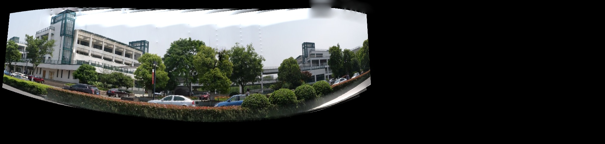
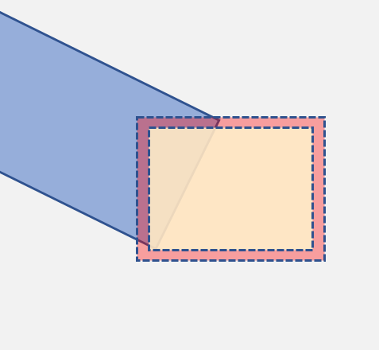

<h1 style="text-align: center"> 全景图拼接 </h1>
<h3 style="text-align: center"> 计算摄影学 Lab 8 报告 </h3>
<h5 style="text-align: center"><medium>林昭炜 - 2020.6</medium></h5>
<h5 style="text-align: center"><medium>3170105728</medium></h5>


## 一、  简介

全景图是基于多张图片寻找特征点对应之后进行图像的拼接。

实验中使用了柱面坐标，虽然理论上只要平移图像就能计算得到正确的图像，但是实际效果不理想，所以在实验中最终选择了 Homography 变换。


在实验中我实现了

1. 平面到柱面左边的变换
2. 利用 OpenCV 提取了特征点、匹配以及 Homography 的变换
3. 使用 erosion 创建多个遮罩提取了梯度域的图像
4. 对拼接图片进行了梯度域的融合


## 二、 实验环境

**编译环境**: Visual Studio 2019, C++17

**运行环境**: Windows 10,16GB RAM, i7 7700HQ

**OpenCV**: 4.1.1

**Eigen**: v3.3.3 Nuget包管理安装


## 三、理论基础

### 柱面坐标

我们在柱面坐标上进行计算，柱面坐标的变幻公式是:
$$
x'=rtan^{-1}(\frac{x}{f})\\
y' = \frac{ry}{\sqrt{x^2+f^2}}
$$
但是这个公式变换后的问题是其会导致图像集中在左上角。所以实验中用到的变换公式如下:
$$
x'=f\cdot atan(\frac{x-0.5\cdot width}{f})+f\cdot atan(\frac{0.5\cdot width}{f})\\
y' = \frac{f\cdot (y-0.5\cdot height)}{\sqrt{(x-0.5\cdot width)^2+f^2}}+0.5 \cdot height
$$
对应的逆变换是:
$$
x = tan(\frac{x'}f-atan(\frac{0.5\cdot width}{f}))\cdot f+0.5\cdot width\\
y = \frac{y'-0.5\cdot height}{f}\sqrt{(x-0.5\cdot width)^2+f^2}+0.5\cdot h
$$


### SIFT

#### 特征点提取

首先对图像做降采样得到一系列Octave：前一个Octave中图像的大小为后一个的两倍，对每一个 Octave 使用不同的 $\sigma$ 的高斯卷积核做卷积，Octave 间的图像上下差分获得 DoG 空间的图像。

接下来把空间里上下两层共 2*9 个点中是极大值或者极小值的点当作当前尺度的特征点，记为 $K(x,y, \sigma)$.


#### 关键点定位

去除不好的特征点，利用泰勒展开和导数去迭代特征点，精确地定位关键点。

然后消除边缘效应，利用 Hessian 矩阵:
$$
H=\left(\begin{matrix}
D_{xx} & D_{xy}\\
D_{xy} & D_{yy}
\end{matrix}\right)
$$
的特征值去把边缘点去除。


#### 关键点描述

计算关键点 16*16 所在领域像素的梯度幅值和方向，利用直方图统计周围像素的梯度，利用直方图对应个数最多的作为像素梯度方向。

为了权衡较小和较大的窗口，会把 16*16 划分成 4\*4 个小窗口，计算小窗口的像素梯度方向，使用像素边的方向作为其值，最终每个小窗口形成 16 维向量，一个大的窗口相应是 128维向量作为特征点。


### 特征点匹配

首先是特征点的对应，这里可以直接用欧拉距离来计算特征点的相似程度:
$$
Dist(u_i,v_i) = \sqrt{\sum_{t=0}^{N}(u_i[t]-v_i[t])^2}
$$
这里我们可以直接计算两张图片每一对点计算距离，然后取得最小的，距离，而对于多个点对的问题。

这样的计算可以用暴力算法 (BruteForce) 算法，测试每一种组合的可能性，如果我们每次去找匹配度最高的点，反复迭代得到一组点对，这样的时间复杂度，对于两组数量为 $n$ 的特征点，那么其时间复杂度是 $O(n^2)$


### 映射矩阵的计算

我们需要计算一个三维的矩阵，这是一个三元方程组，这意味着我们需要3对向量来计算方程组的参数。对于三对特征点 $k_i, k_i'$ 来说，我们可以用如下公式去解:
$$
\left(\begin{matrix}
k_1[1]' & k_2[1]' & k_3[1]'\\
k_1[2]' & k_2[2]' & k_3[2]'\\
1 & 1 & 1
\end{matrix}\right) = A 
\left(\begin{matrix}
k_1[1] & k_2[1] & k_3[1]\\
k_1[2] & k_2[2] & k_3[2]\\
1 & 1 & 1
\end{matrix}\right)
$$
那么我们直接用矩阵的的求逆等方法求解映射矩阵。

对于多个特征点，每一组（3对）特征点可能计算出来的映射矩阵是不一样的。所以我们使用 RANSAC 方法计算：

RANSAC 的基本假设是所有数据点中异常数据不是占多数 (<50%), 那么我们可以通过几次迭代就能以极高的概率得到的点是非异常的，而且其计算出了的映射矩阵应该是正常的。

其算法如下：

1. 在样本中随机抽取 n 对点，计算映射矩阵
2. 利用映射矩阵把其他点对映射，检查是否误差小于阈值，如果是，就把计数器加一
3. 反复迭代使得映射完后的计数器最大
4. 去除哪些超过阈值的点，然后把好的点用最小二乘法等计算最终结果


### 实现多张图片拼接

至此我们一直在讨论两张图片的拼接，我们要实现多张图片的拼接需要利用矩阵的性质。如果以某一张图片为中心，那么这个图片对应的矩阵是单位矩阵。不妨有如下假设:

假设图像 $I_i$ 到 图像 $I_j$ 的变换是 $M_{ij}$。

$I_{mid}$ 是所有图片中作为中心的图片。

$Identity$ 是单位矩阵。那么我们有：
$$
M_{k, mid} = \begin{cases}
\prod_{i=k}^{mid} M_{i,i+1}^{-1}, & k < mid,\\ \\
Identity,& k = mid,\\ \\
\prod_{i=mid}^{k} M_{i,i+1}, & k > mid,\\

\end{cases}
$$
其中对于任意 $M_{i,i+1}$ 我们都是知道的，这可以用之前的两张图像拼接的办法算出来。

由此我们可以计算出每一张图片相对于中心图片的变换矩阵。


### 梯度域融合 (Gradient Domain Fushion)

拼接后的图片会有明显的痕迹，在这里我使用了大程中用到的梯度域融合算法。消除问题的核心想法是: 我们在边缘上的点，其梯度应该和原来的图像保持一致，所以我们希望能满足一个边界条件，这个边界条件被叫做纽曼边界条件 (Neumann Boundaries):
$$
v_{x+1,y}-v_{x,y}=\nabla I_x(x,y)\\
v_{x,y+1}-v_{x,y}=\nabla I_y(x,y)
$$

要解这个方程，我们可以列一个巨大的矩阵，因为这个矩阵是稀疏的，所以我们可以用共轭梯度法去求解矩阵。在 Lab 3 中我实现了共轭梯度法，这里再次介绍一下原理:

求解 $Ax=b$ 的时候，我们可以转化为对二次型 $f(x)=\frac12x^TAx-b^Tx+c$ 导数为0的求解。

即我们有:
$$
\frac{df(x)}{dx} = Ax-b.
$$
这里只要暴力把矩阵和向量展开相乘即可证明，不在此赘述。


### Erosion & Dilation

由于实验中利用了对遮罩的腐蚀，所以这里简单讲一下原理。

Erosion 和 Dilation本质差不多，他们是这样定义的
$$
Dilation: A \oplus B = \left\{z|(B)_z \cap A \neq \varnothing\right\}\\
Erosion: A \ominus B = \left\{(x,y)|(B)_{xy} \subseteq A\right\}
$$
事实上再实际计算过程中可以用同一个算法
$$
Conv_{ij} = kernel\otimes Image_{ij},\\
Image_{ij}' = 
\begin{cases}
0, \quad Conv_{ij} > threshold, \\
1, \quad otherwise.
\end{cases}
$$
对图片卷积，假设卷积核全是正数并且图像为0，1.对于Erosion来说需要卷积结果等于卷积核的的L1范数(threshold)即可, 而Dilation只需要卷积结果大于0即可。


## 四、具体实现

### 图像关键点检测

这里直接调用了 OpenCV 内建的函数，由于 SIFT 算法是专利算法，在 OpenCV 较高版本里没有实现，所以实验中我去调查了一些其他算法，包含了 Surf, Kaze, Akaze, ORB 和 Brisk 等算法 [^algo]

[^algo]: https://www.researchgate.net/publication/323561586_A_comparative_analysis_of_SIFT_SURF_KAZE_AKAZE_ORB_and_BRISK

大致了解了一下这些算法的优缺点:

| 算法  | 关键点数量 | 耗时                          |
| ----- | ---------- | ----------------------------- |
| Sift  | 分布较为广 | 大约是 Kaze的一半             |
| Surf  | 比 Sift 多 | 比 Sift 快                    |
| Kaze  | 最少       | 最高                          |
| Akaze | 比 Kaze 多 | 比 Sift, Surf 快，比 Brisk 慢 |
| ORB   | 最多       | 最快                          |
| Brisk | 第二多     | 比ORB 略慢                    |

经过权衡最终我选择了 Akaze 算法。其在 OpenCV 中使用非常简单:

```c++
pdetector = AKAZE::create();
void detect(cv::InputArray image, std::vector<cv::KeyPoint>& keypoints, cv::OutputArray descriptors) {
	pdetector->detectAndCompute(image, cv::noArray(), keypoints, descriptors);
}
```


### 特征点匹配算法

这里利用了 OpenCV 中的 BFMatcher， 就是 Brute-Force Matcher, 利用暴力算法计算:

```c++
pmatcher = BFMatcher::create();
pmatcher->match(queryDescriptors, trainDescriptors, matches);
```

这里我们只取前 80 个最佳的匹配作为我们的结果，这个数值是实验中得到的，因为前 80 个能保证匹配点都在图片要重合的区域内。

所以对于match 完的数组，我们有如下操作:

```c++
std::sort(matched.begin(), matched.end());
matched.erase(matched.begin() + 80, matched.end());
```


### 计算映射矩阵

这里使用了 OpenCV 的 findHomography 来计算两张图片之间的矩阵，不过在做这个之前需要稍微修改一下数据类型:

```c++
a.resize(matched.size());
b.resize(matched.size());

// make data of best matches
for (int i = 0; i < matched.size(); ++i) {
    a[i] = im1.keypoints[matched[i].queryIdx].pt;
    b[i] = im2.keypoints[matched[i].trainIdx].pt;
}

m = findHomography(b,a, RANSAC);
```


### 估算最终画布尺寸

为了能估算最终的画布尺寸，我们需要利用四个顶点的信息，这里我创建了一个类，负责处理这些事物，在这里我根据 OpenCV 给出的 `warpPerspective` 公式:
$$
dst(x,y) = src(\frac{M_{11}x+M_{12}y+M_{13}}{M_{31}x+M_{32}y+M_{33}}, \frac{M_{21}x+M_{22}y+M_{23}}{M_{31}x+M_{32}y+M_{33}}).
$$
计算最终图片的大小，然后反复求得四个角的最大值（距离中心最远），最终得出的是外包围盒，内包围盒同理可以利用四个角的最小值:

```c++
void fromTransformedRect(cv::Mat t, cv::Rect r) {
    auto g = [&t](int i, int j) {
        return t.at<double>(i, j);
    };
    auto apply = [this, &t, &g](int idx, int x, int y) {
        box[idx].x = g(0, 0) * x + g(0, 1) * y + g(0, 2);
        box[idx].y = g(1, 0) * x + g(1, 1) * y + g(1, 2);
        box[idx].z = g(2, 0) * x + g(2, 1) * y + g(2, 2);
        box[idx].x /= box[idx].z;
        box[idx].y /= box[idx].z;
    };

    apply(TopLeft,     r.tl().x, r.tl().y);
    apply(BottomLeft,  r.tl().x, r.br().y);
    apply(BottomRight, r.br().x, r.br().y);
    apply(TopRight,    r.br().x, r.tl().y);
}
```


而外包围盒的算法如下:

```c++
void wrap(Quadrangle r) {
		using std::max;
		using std::min;

		box[TopLeft].x = min(box[TopLeft].x, r.box[TopLeft].x);
		box[TopLeft].y = min(box[TopLeft].y, r.box[TopLeft].y);

		box[BottomLeft].x = min(box[BottomLeft].x, r.box[BottomLeft].x);
		box[BottomLeft].y = max(box[BottomLeft].y, r.box[BottomLeft].y);

		box[BottomRight].x = max(box[BottomRight].x, r.box[BottomRight].x);
		box[BottomRight].y = max(box[BottomRight].y, r.box[BottomRight].y);

		box[TopRight].x = max(box[TopRight].x, r.box[TopRight].x);
		box[TopRight].y = min(box[TopRight].y, r.box[TopRight].y);
	}
```


### 叠加矩阵的计算

正如之前所说的，我们首先需要选定一张图片作为中心图片，而其他需要依次叠加矩阵。这里出于效率考虑，我们不需要对于每一张图片用连乘反复计算，我们只要存储上一张图片的矩阵值，然后乘上当前的变换矩阵值即可。

对于在图片左侧的的图像来说，我们有:

```c++
for (int i = mid-1; i >= 0; --i) {
    auto& match = matches[i];
    auto& tran = match.m;
    Mat mytran = tran.inv() * trans_cul;
    trans_cul = mytran.clone();

    Quadrangle b;
    b.fromTransformedRect(mytran, Rect(0, 0, cols, rows));

    bounds.push_back(b);
    trans.push_back(mytran);
}
	
```

值得注意的是这里计算的矩阵顺序是反的，我们需要逆序以下:

```c++
std::reverse(bounds.begin(), bounds.end());
std::reverse(trans.begin(), trans.end());
```

而参考图片右侧的则不需要如此求逆序了。


### 梯度求解

如果直接把每一张图像的梯度叠加，会出现非常糟糕的结果如下:




如果我们观察梯度图像我们可以发现:


> 上图是 X 梯度, 下图是 Y 梯度


本质原因是我们把图像边缘的梯度也计算在内，我们在计算梯度的时候应该避免计算图像边缘，而且图像靠近边缘的梯度往往不可靠。

一个比较直观的想法是，我们可以沿着 x 轴扫描，如果我们遇到新增加的梯度部分的值和原图部分重合，我们选择先跳过一部分像素。比如下图，蓝色是当前的梯度，橙色是要拼接的梯度图像，用虚线表示，那么我们新增的部分是由橙色线框表示。


但是这个方法有严重的局限性，比如下图，如果我们新增的图像是一部分边缘和 x 轴平行，跳过的像素点太少那么会导致很多边缘没法被去除，途中亮黄色线条就是哪些没法被去除的边缘。但是我们如果跳过过多像素点会导致空洞的产生。


一个更好解决办法是我们用两个遮罩，我们分为如下几个情况（文字会配合下图说明）

1. 重叠部分
   1. 如果像素在外遮罩，而不在内遮罩 ( 图像紫色部分)，选择原来的梯度(蓝色图像的梯度)
   2. 图像在内遮罩选择新增图像的梯度
2. 不重叠部分，选择有梯度的图像作为该点的梯度值

外遮罩就是新增图片的遮罩，内遮罩就是对外遮罩的腐蚀操作，实验中用的是十字核对图像遮罩进行腐蚀。




以上算法依然存在最大的问题是图像和非图像边界的梯度消失，但是我们必须要维持这个梯度，否则梯度域融合会把外部的黑色传播到图像内。这个主要原因是遮罩计算无法很精确，产生了错误的遮挡（只是一个像素也对结果影响非常大），所以我需要最后对图像和非图像的交界处重新计算一遍梯度。代码如下:

```c++
void EnforceGradientBound(cv::Mat& dx, cv::Mat& dy, cv::Mat src, cv::Mat mask)
{
	using namespace cv;
	for (int i = 0; i < dx.rows; ++i) {
		uchar* ptr = mask.ptr(i);
		for (int j = 0; j < dx.cols; ++j, ++ptr) {
			if (*ptr) {
				GradientAt(src, j, i, dx.at<Vec3f>(i, j), dy.at<Vec3f>(i, j));
				GradientAt(src, j, i - 1, dx.at<Vec3f>(i - 1, j), dy.at<Vec3f>(i - 1, j));
				GradientAt(src, j, i + 1, dx.at<Vec3f>(i + 1, j), dy.at<Vec3f>(i + 1, j));
			}
		}
	}
}
```


### 梯度域融合

我把还未融合的图像作为初始值，然后交给梯度域融合算法把图像进行融合。梯度域融合我用的是大程 Digital PhotoMontage 的算法，

代码第一步是构造稀疏矩阵:

```c++
// 构建求解泊松方程的稀疏矩阵
	for (int y = 0; y < height - 1; y++)
	{
		int idx = y * (width - 1) * 4;
		for (int x = 0; x < width - 1; x++)
		{
			int col_xy = width * y + x;

			// 第 2k 行, 在矩阵里表示 v(x+1,y)-v(x,y)
			int row_xy = 2 * col_xy;
			int col_x1y = col_xy + 1;
			NonZeroTerms[idx++] = Eigen::Triplet<double>(row_xy, col_xy, -1); // -v(x, y)
			NonZeroTerms[idx++] = Eigen::Triplet<double>(row_xy, col_x1y, 1); // v(x+1, y)
			Vec3f grads_x = color_gradient_x.at<Vec3f>(y, x);
			b(row_xy) = grads_x[channel_idx];

			// 第 2k + 1 行, 在矩阵里表示 v(x,y+1)-v(x,y)
			int row_xy1 = row_xy + 1;
			int col_xy1 = col_xy + width;
			NonZeroTerms[idx++] = Eigen::Triplet<double>(row_xy1, col_xy, -1); // -v(x, y)
			NonZeroTerms[idx++] = Eigen::Triplet<double>(row_xy1, col_xy1, 1); // v(x, y+1)
			Vec3f grads_y = color_gradient_y.at<Vec3f>(y, x);
			b(row_xy1) = grads_y[channel_idx];
		}
	}
```


然后我们把矩阵改成方阵:

```c++
Eigen::SparseMatrix<double, Eigen::RowMajor> ATA(width * height, width * height);
ATA = A.transpose() * A;
Eigen::VectorXd ATb = A.transpose() * b;
```


最后调用我们的矩阵API求解:

```c++
auto MyMatrix = ConvertFromEigen(ATA);
std::vector<double> myATb;
myATb.insert(myATb.begin(), ATb.data(), ATb.data() + ATb.rows());
auto mysolution = MyMatrix.conjugateGradient(myATb, 1e-10, iterations_, init);
```


## 五、实验结果


**拼接结果1**


**梯度域混合结果1**


**拼接结果2**


**梯度域混合结果2**


### 问题和不足

在梯度域融合的时候图像边缘处往往有较大的问题，主要是遮罩的计算问题，遮罩容易产生大量的毛刺，这导致最终的梯度计算结果还是有一定的问题。


### 性能

主要瓶颈是梯度的计算和梯度域融合，大于每增加一张图片需要额外的 1s 左右的时间。


## 六、编译运行

#### 编译说明

由于实验中依赖多个 C++17 特性，包括了: `std::filesystem` 用于扫描目录, `std::reduce_transform` 用于多线程的向量操作和计算, `if constexpr() ` 编译期优化分支结构。

实验中依赖  Eigen 进行转置等运算，通过 VS 的 Nuget 作为 Package 安装。

实验中依赖 OpenCV 4.1.1

如果要输出中间过程请在 config.h 中打开 `DEBUG_WRITE` 编译宏。


#### 运行说明

程序启动会自动扫描所在目录，列出可选的目录。选择目录之后也会自动扫描所有图片，按照名字排序，依次拼接。


