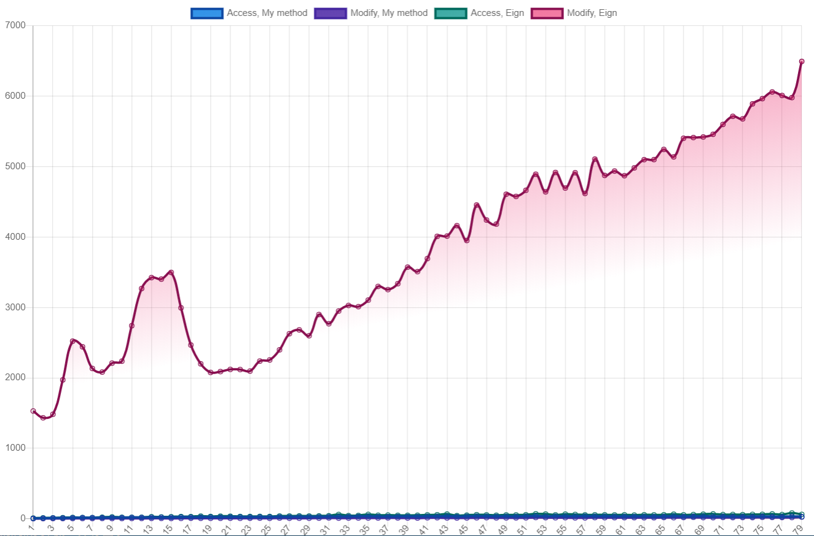

## Computational Photography
     ![IMG](https://img.shields.io/badge/Eigen-v3.3.3-6ebe4c?logo=data:image/jpg;base64,iVBORw0KGgoAAAANSUhEUgAAABAAAAAQCAYAAAAf8/9hAAAABHNCSVQICAgIfAhkiAAAAAZiS0dEAP8A/wD/oL2nkwAAAzVJREFUOI2Vk2toWwUUgL/7Sm4ezW1y+1hb7XutazV9iFq7iY9RGKtzylBBB3XTIYK4/hNx/vKXilBBwQcTBGVaEXSCTOo66mZig3ahLWMNTVvXrdJkSZqS9t6myb3+Sqn+8/w653DOdw7nIfE/pL//4KX2trvPtrZ0KPGF65cAxN0BDgeDjzSI53e5jgGHS0YodDHk87mlZCp1uuQT/lvlSLucKXfLXvlvU36gD/xVcGUGLEHMji63asnlpD08/JIwMvLeM8C30tBzx0aGXny59+cLFy4DxFLW7MNlheMH3v8aq/4QC5k68r4g/vUpdVHqzOma6qzQ/WSzubq1tfTnYq2uDZwdHm4tdbD/TvGMugJHn3oWiSJqbSOvv/sOzi1w3fh1vojAxESY/HahH0BajVw9cnSg7Om+DtbCseJkpy6cqm227wjPrSEaZ/hr8hemf19CMa7x1SzRdDozim01l/v8akOt3y8AgRP3qqnmGoXRmPHqTKzQ+ULQ8YpXyNP1eAOxaYtbs8skbYmxpeK/ZtbbpDwvAUbPHnsgGt+uH7zLdbinTr7P5bTY21ZFS2sXbsFEsTL4VZmmavmNmZXCIjDT3qA11lV6PDvEoaCSckhCwOMAl9fBQ4/1UtnUwub6OhPff4ckeXCpMgsrJh+Gt3by5JKSx46UKcIhXZcwtTq8lTUUCzZNXT1E5xIsRi4Tmocnut2cfFS302LgkyqfpUklQEDii2CTJDZ37mNvV5B8QcSrKsgulbwl4VXg4/GkHYrnCeoF4dyq1SFFb320c4l7KmTpdiaPJbmQrDxeVSa7ZbNtmCiiSHRulbfffFIw76kQQn9uc6C73h3xqIEdgACsGwK53AbpRIJAtY5bsbgZj2Nmb9NWozIWnue1B3tRjt/PlZxpkDSjO4DlbOE3TfeB08PNG6tsplfZzCQw0issXJ1kaWGFxPi0rZVrTH8Z+eHHRdEFjO3e6+kTfepbQtHWnfY2LtnC7Zbx6z4SaZPIdQOHIpBKWht/bOA9BUufQePub/zAv6/q04RLuza16fxpPiWGE4a4ND6VNb+5uBnv3l+TjRniucEcXuBgtaZ5gZP/APZGOvC+1hCuAAAAAElFTkSuQmCC)

This is a repo for computational photography at ZJU.

`labs/` contains 5 lab projects

- [lab2](labs/lab2): Basic filters, including a multi-thread median filter **faster than OpenCV** (tested with 8 threads, while opencv has one thread only). [report here](labs/lab2/lab2.md) [English Description](#Lab 2: Filters)

- [lab3](labs/lab3): Sparse Matrix & Gauss-Seidel Implementation. Modifying & Accessing my sparse matrix is faster than Eigen.

- [lab4](labs/lab4): Least Mean Sqaure optimization with Gauss-Newton (The course is haunted by gauss)

- [lab5](labs/lab5): AR application using Vuforia + Unity. 

- [lab8](labs/lab8): Paranoma, stitching + gradient domain fushion


[project](project) contains final project for Digital Photomontage

## Project: Interactive Digital Photomontage

[](https://youtu.be/aP075Cz8zFM)

[](https://youtu.be/aP075Cz8zFM)


My improvements of gradients domain fushion. It can **reduce 90% of iterations.**


## Lab 2: Filters

**Highlights:** In the experiment, I designed and optimized the median filter algorithm. When the median filter template size is large, I use the advantages of multi-threading to achieve faster code than OpenCV.

The simplest version of the median algorithm is to obtain the median by sorting:

```c++
vector arr = all_pixel_in_window();
sort(arr);
median = arr[arr.size()/2]
```

The advantage is that STL achieves fast sorting and is very fast, but the disadvantage is that for the median window of  , each pixel needs )) time.

I searched for some information, and thought of the following optimizations (maybe set  for later analysis)

- Optimization of the sorting algorithm, fast sorting usually requires recursive sorting on both sides of the pivot separately, and only one side is needed for finding the median value, but this is not optimized in order of magnitude

- Using the heap method, maintain a max heap and a min heap respectively, and the two heaps are equal in size. Every time the statistics window of the median value is moved, old elements are deleted and new elements are added, and finally the balance of the two heaps is maintained. The worst case is that one heap has been deleted and the other has been added, so we have to operate $4*N$. In theory, delete and add fast heaps such as Fibonacci heaps and binomial heaps.) time is completed, which means that the time complexity is ), but in fact this may be slower than sorting: First of all, the complexity constant is very large. In previous ADS experiments, it turned out that this constant was so large it cannot be ignored. Secondly, the heap keeps moving pointers and so on, which is not CPU Cache friendy.

- Maintain a perfectly balanced tree. This algorithm is too difficult to implement and I did not take it into consideration.

In the end I decided to use the hash histogram method. I maintain two arrays. The size of array A is 16 and the size of array B is 256. For the pixel value `I` in each window, do the following operations:

```c++
A[I / 16]++;
B[I]++;
```

Then when we want to calculate the median value, we only need to search the approximate range in array A, and then accurately locate in array B. This time complexity is =O(MN))

But it can be further optimized. Every time we move the window, only part of the data changes. We don't need to update all the data, so we need to maintain two additional variables, as shown in the following figure:


The variable Before A records the sum before the A array position where the median is located. Before records the median of the 16 B array elements corresponding to the A array, and the sum of the elements before it.

In this way, we only need to check the replaced elements and update the size of Before A and Before B accordingly, and then we start from (Before A + Before B) to find and reposition the median.

In fact, this is still much slower than OpenCV, about 3 times slower. Inspired by OpenCV's usage of AVX, I thought of using multi-threading technology. Each thread calculates a part of the picture separately, so as to achieve a faster algorithm than OpenCV in the case of a larger window (>=7) (see experimental results for details). However, OpenCV is incredibly fast when the window size is only 3 or 5, usually 1ms is just fine.


> Comparision between my implementation & OpenCV's implementation. Runs on i7-7700HQ (4 cores). 
> Blue:Mine, Green:OpenCV

| Lena in salts & pepper                                                     | **Median 9x9**                                               |
| ------------------------------------------------------------ | ------------------------------------------------------------ |
|                                   |  |
| **Median 29x29**                                             | **Median 59x59**                                             |
|  |  |


## Lab 3: Sparse Matrix & Gauss Seidel

**Highlights:** I implemented a sparse matrix class in C++. Compared with Eigen, it increases the space overhead by about 25%-50%, faster access speed than Eigen, and much **faster insertion speed (about 500x) than Eigen**. It also supports the initialization function required by the experimental guidance.


First, I used `Values` to save all the data, and the same array `Column Index` correspondingly saved the corresponding Column information.

The reason for using Structure of Arrays is because many operations only search for Columns in `Column Index`, and if Array of Structures is used, a large part of the Cache will be wasted and useless Values ​​are saved, greatly sacrificing the hit rate of Cache.

Next, I need to divide the `Value` array into small arrays, and pass the additional two arrays `#NonZeros` and `#Zeros` to count the number of non-zero elements and free space in the small array. The reason for this is that if you zero an element in the row, it will be very fast, you only need to move a small step of data. Similarly, when inserting an element, if there is already some remaining space, then we only need to move A small amount of elements is sufficient. This has played an important role in inserting faster than Eigen, but it also inevitably brings additional memory overhead.

Finally, `Row Index` stores the offset of the first element of the current row in Values.

In fact, the above code simulates the effect of `srd::vector<std::vector<T>>`, the reason why it is not used directly is as follows:

-A large number of `std::vector<T>` causes memory fragmentation
-The memory is not continuous and the access efficiency is low. The continuous memory makes the Cache access friendly, and the compiler can better optimize the code
-`std::vector` generally has 4 pointers of `begin`, ʻend`, ʻend_of_storage`, ʻallocator`, which is about 32 bytes on a 64 bit system, but my implementation only takes up 12 bytes (3 ints) .

In the code, `row_num_nze_` represents Number of Non Zero Elements, which corresponds to `#NonZeros` in the figure, and `row_space_left_` corresponds to `#Zeros` in the figure.


#### Insert

insert is very complicated, there are 6 cases to consider here

1. The insert element is 0
    1. The inserted element itself is 0 **(1)**
    2. The element being inserted is not 0 **(2)**
2. The insert element is not 0
    1. This element is not 0 **(3)**
    2. This element was originally 0
       1. There is still space in this row **(4)**
       2. This row has no remaining space **(5)**

So the corresponding pesudocode is as follows:

```c++
void insert(T&& val, Index row, Index col) {
    return val == T(0) ?
        // handle 0 & 1
        insertZero(row, col) :
    	insertNoneZero(std::forward<T>(val), row, col);
}
```

The code is proven by randomly generate data and use Eigen as baseline. The data of below images are generated by [benchmark.py](labs/lab3/benchmark.py)

First, compare the sparsity of the matrix with the speed of insertion and modification. The amount of data is 1000x1000, and the vertical axis is time (ms)


Eigen is extremely slow to modify the data, and the table after the modified data is added:




Then there is the relationship between performance and matrix size: In terms of access, the reason I am a little faster than Eigen is that Eigen needs to deal with row major and column major, but I have fixed row major.


Similarly, Eigen is very slow to modify elements, and the growth trend is basically ).


## Lab 4: Least Mean Sqaure optimization

Python 可视化如下:

| Circle                                                           | Ellipsoid                                                        |
| ------------------------------------------------------------ | ------------------------------------------------------------ |
|  |  |
| **Circle** High Noise                                             | **Ellipsoid** Local Data Points                               |
|  |  |


## Lab 5: AR

[](https://youtu.be/XMA1fyXS2cY)

[](https://youtu.be/XMA1fyXS2cY)


## Lab 8: Panoroma

If you directly superimpose the gradient of each image, there will be very bad results as follows:


If we observe the gradient image we can find:


> The upper picture is the X gradient, the lower picture is the Y gradient


The essential reason is that we also include the gradient of the edge of the image. We should avoid calculating the edge of the image when calculating the gradient, and the gradient of the image close to the edge is often unreliable.

A more intuitive idea is that we can scan along the x-axis. If we encounter the value of the newly added gradient part and the original image partly overlap, we choose to skip some pixels first. For example, in the figure below, blue is the current gradient, and orange is the gradient image to be stitched. It is represented by a dashed line, then the newly added part is represented by an orange wireframe.

However, this method has serious limitations. For example, if we add some of the edges of the image that are parallel to the x axis, and the skipped pixels are too few, then many edges will not be removed. What are the bright yellow lines on the way Edges that cannot be removed. But if we skip too many pixels, it will cause holes.


A better solution is to use two masks. We divide them into the following situations (the text will match the description below)

1. Overlap
   1. If the pixel is in the outer mask and not the inner mask (the purple part of the image), select the original gradient (the gradient of the blue image)
   2. Select the gradient of the new image in the inner mask of the image
2. For non-overlapping part, select an image with gradient as the gradient value of the point

The outer mask is the mask of the newly added image, and the inner mask is the corrosion operation of the outer mask. In the experiment, a cross check is used to corrode the image mask.


The biggest problem with the above algorithm is that the gradient between the image and the non-image boundary disappears, but we must maintain this gradient, otherwise the gradient domain fusion will spread the external black into the image. The main reason for this is that the mask calculation cannot be very accurate, resulting in wrong occlusion (just one pixel also has a great influence on the result), so I need to recalculate the gradient at the junction of the image and the non-image.


I also use Gradient Domain Fushion to seam images.